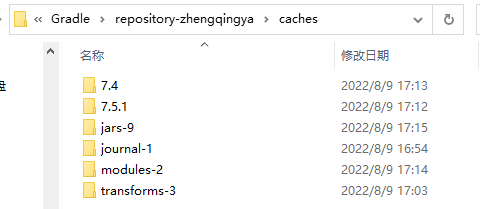

### wrapper包装器


指定项目使用的gradle版本，即无需我们本地单独安装gradle，统一版本管理

`gradle`相关命令通过`gradlew`或`gradlew.bat`脚本替换

`gradlew`和`gradlew.bat`脚本底层调用的是`gradle-wrapper`中指定的gradle版本


#### `gradle-wrapper.properties`

```
distributionBase=GRADLE_USER_HOME
distributionPath=wrapper/dists
distributionUrl=https\://services.gradle.org/distributions/gradle-7.4-bin.zip
zipStoreBase=GRADLE_USER_HOME
zipStorePath=wrapper/dists
```

从`distributionUrl`下载指定gradle版本后，
放在`zipStoreBase/zipStoreBase`目录下,
解压到`distributionBase/distributionPath`目录下，
并缓存到`${GRADLE_USER_HOME}/caches`目录下 => 下次使用相同版本时则无需再次下载。


