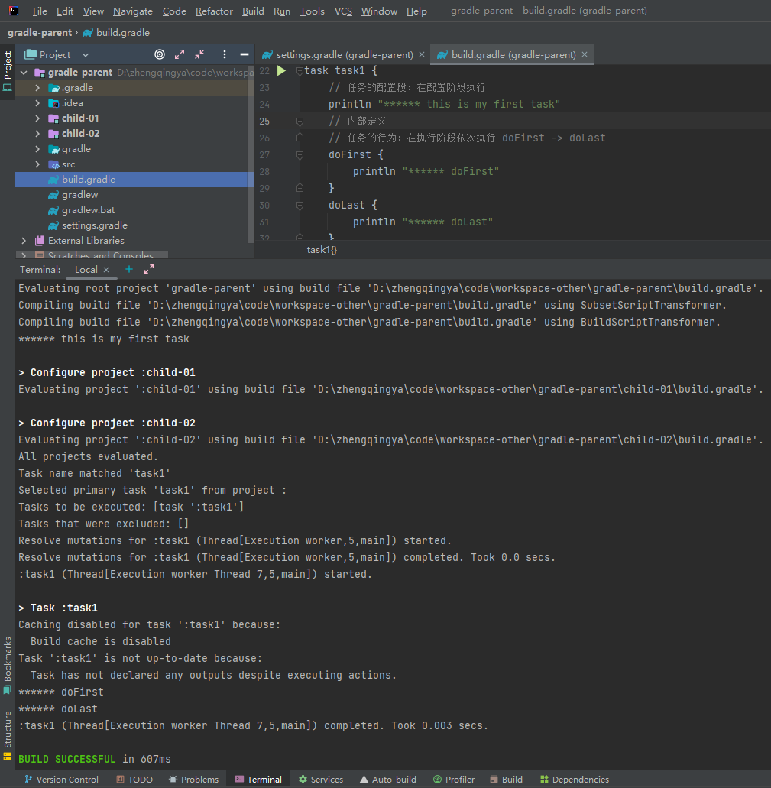

### 任务入门

定义任务

`build.gradle`

> 内部定义

```
task task1 {
    // 任务的配置段：在配置阶段执行
    println "****** this is my first task"
    
    // 内部定义
    // 任务的行为：在执行阶段依次执行 doFirst -> doLast
    doFirst {
        println "****** doFirst"
    }
    doLast {
        println "****** doLast"
    }
}
```

执行任务

```shell
gradle -i task1
```



### 任务行为

外部定义

```
def map = new HashMap<String, Object>()
// action属性可设置闭包，设置task自身行为
map.put("action", { println "****** action" })

task(map, "task1") {
    // 任务的配置段：在配置阶段执行
    println "****** this is my first task"

    // 内部定义
    // 任务的行为：在执行阶段依次执行 doFirst -> doLast
    doFirst {
        println "****** doFirst"
    }
    doLast {
        println "****** doLast"
    }
}

// 外部定义
task1.doFirst {
    println "****** doFirst out"
}
task1.doLast {
    println "****** doLast out"
}

task1.doFirst {
    println "****** doFirst out out"
}
```

执行任务

```shell
gradle clean
gradle -i task1
```

执行顺序

`doFirst out` <- `doFirst` <- `action` -> `doLast` -> `doLast out`

1. 后声明的`doFirst`放最前面执行
2. 后声明的`doLast`放最后面执行

