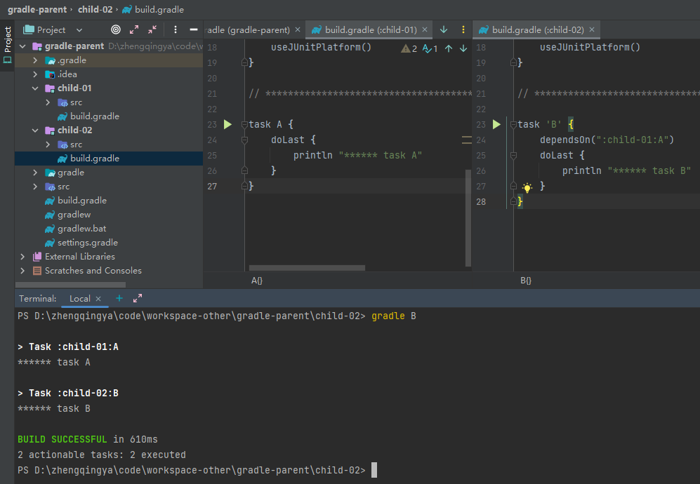

### 参数依赖

```
task A {
    doLast {
        println "****** task A"
    }
}

task 'B' {
    doLast {
        println "****** task B"
    }
}

// 会先执行任务A和B 再执行任务C
task "C"(dependsOn: ['A', 'B']) {
    doLast {
        println "****** task C"
    }
}
```

执行任务

```shell
gradle clean
gradle C
```


### 内部依赖

```
task A {
    doLast {
        println "****** task A"
    }
}

task 'B' {
    doLast {
        println "****** task B"
    }
}

task "C"() {
    dependsOn = ['A', 'B']
    doLast {
        println "****** task C"
    }
}
```

### 外部依赖

```
task A {
    doLast {
        println "****** task A"
    }
}

task 'B' {
    doLast {
        println "****** task B"
    }
}

task "C"() {
    doLast {
        println "****** task C"
    }
}

C.dependsOn = ['A', 'B']
```

### 跨项目依赖

`gradle-parent\child-01\build.gradle`

```
task A {
    doLast {
        println "****** task A"
    }
}
```

`gradle-parent\child-02\build.gradle`

```
task 'B' {
    dependsOn(":child-01:A")
    doLast {
        println "****** task B"
    }
}
```



### 其它

1. 当一个Task依赖多个Task时，被依赖的Task之间如果没有依赖关系，则它们的执行顺序是随机的。
2. 重复依赖的任务只会执行1次
   