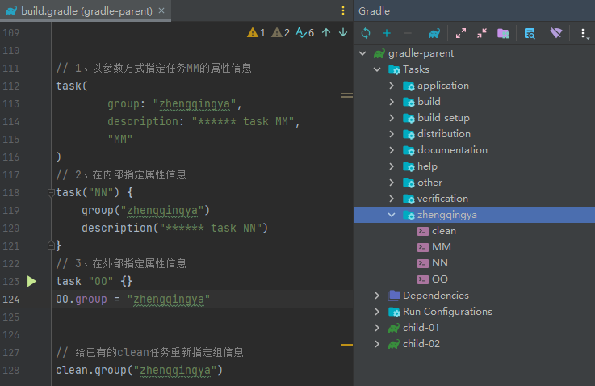

### 任务定义方式

#### task()方法

```
// 任务名称,闭包都作为参数
task('AA', {
    println "****** task AA"
})
// 闭包作为最后一个参数可以直接从括号中拿出来
task('BB') {
    println "****** task BB"
}
// groovy语法支持省略方法括号
task CC {
    println "****** task CC"
}

def mapDD = new HashMap<String, Object>()
mapDD.put("action", { println "****** task DD" })
// action属性可以设置为闭包
task(mapDD, "DD");
```

#### tasks对象的create或register方法

```
tasks.create('EE') {
    println "****** task EE"
}

tasks.register('FF') {
    // register执行的是延迟创建，只有当task被需要使用的时候才会被创建。
    // `gradle build`：不会被创建
    // `gradle FF`：创建
    println "****** task FF"
}
```

### 给任务分配属性

定义任务的时候可以直接指定任务属性，也可以给已有的任务动态分配属性。

```
// 1、以参数方式指定任务MM的属性信息
task(
        group: "zhengqingya",
        description: "****** task MM",
        "MM"
)

// 2、在内部指定属性信息
task("NN") {
    group("zhengqingya")
    description("****** task NN")
    println "****** task NN"
}

// 3、在外部指定属性信息
task "OO" {}
OO.group = "zhengqingya"


// 给已有的clean任务重新指定组信息
clean.group("zhengqingya")
```

