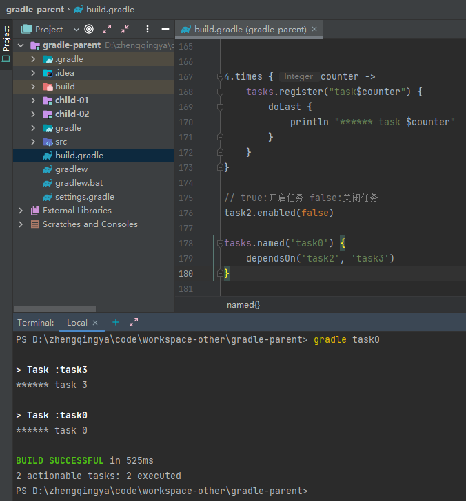

```
4.times { counter ->
    tasks.register("task$counter") {
        doLast {
            println "****** task $counter"
        }
    }
}

// true:开启任务 false:关闭任务
task2.enabled(false)

tasks.named('task0') {
    dependsOn('task2', 'task3')
}
```

