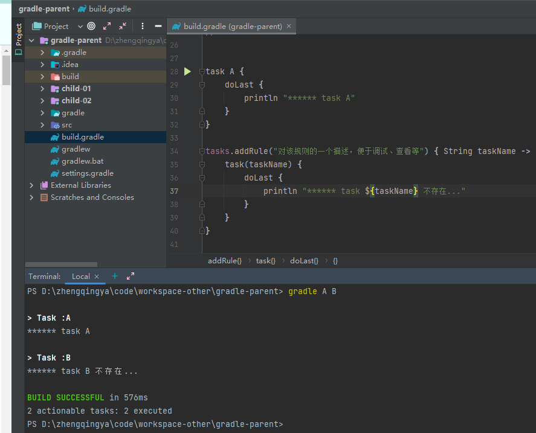

执行一个不存在的任务时，会报错

我们可以通过定义任务规则让其不报错，而是打印提示信息

```
task A {
    doLast {
        println "****** task A"
    }
}

tasks.addRule("对该规则的一个描述，便于调试、查看等") { String taskName ->
    task(taskName) {
        doLast {
            println "****** task ${taskName} 不存在..."
        }
    }
}
```

