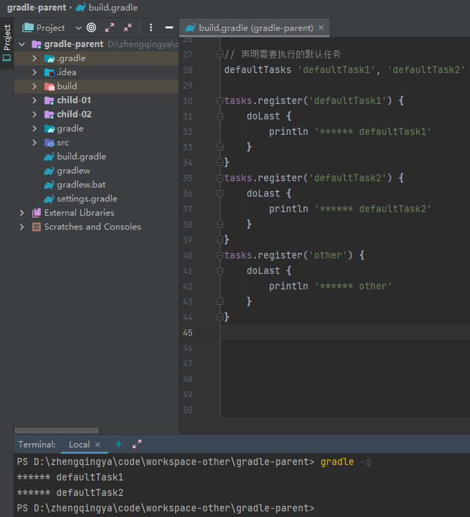

执行默认任务

```
// 声明需要执行的默认任务
defaultTasks 'defaultTask1', 'defaultTask2'

tasks.register('defaultTask1') {
    doLast {
        println '****** defaultTask1'
    }
}
tasks.register('defaultTask2') {
    doLast {
        println '****** defaultTask2'
    }
}
tasks.register('other') {
    doLast {
        println '****** other'
    }
}
```

