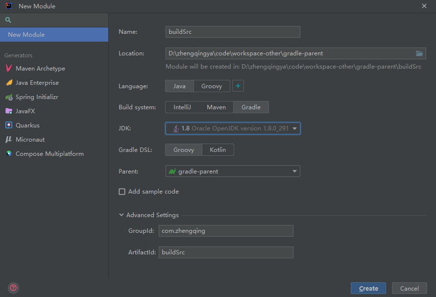
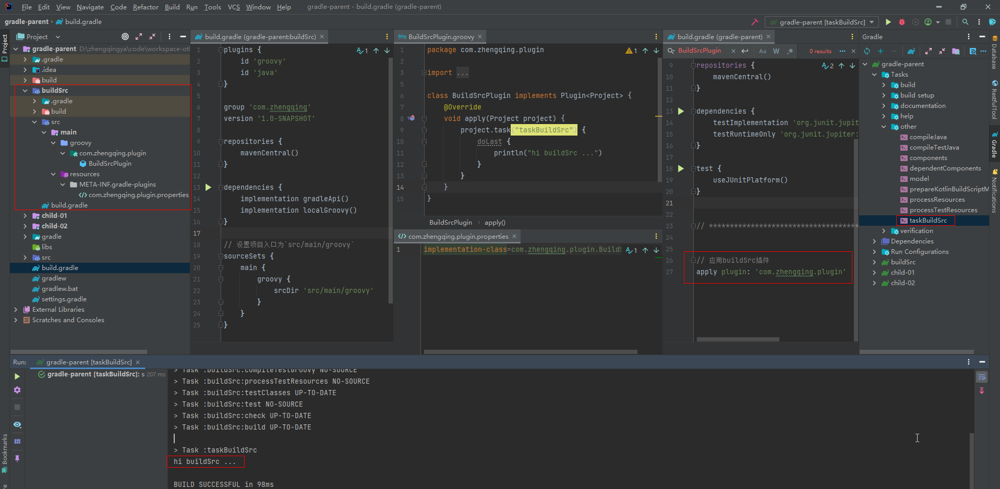
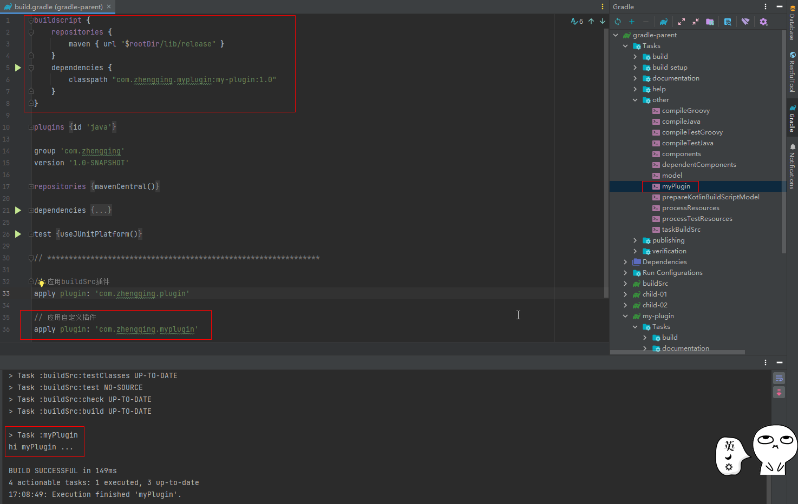

### 自定义插件

> https://docs.gradle.org/current/userguide/custom_plugins.html

#### 自定义脚本插件

> tips: 仅在当前工程下使用

在`build.gradle`脚本中直接使用

```
class GreetingPlugin implements Plugin<Project> {
    void apply(Project project) {
        project.task('hello') {
            doLast {
                println 'Hello from the GreetingPlugin'
            }
        }
    }
}

// Apply the plugin
apply plugin: GreetingPlugin
```

执行任务查看效果

```shell
gradle -q hello
```

#### 自定义buildSrc插件

> tips: 仅在整个工程的module下使用，限制在本工程，其它工程不能使用

在项目中新建一个叫buildSrc名字的module



控制台会报错提示如下

```
'buildSrc' cannot be used as a project name as it is a reserved name
```

解决：在`settings.gradle`中删除`include 'buildSrc'`

`buildSrc\build.gradle`修改

```
plugins {
    id 'groovy'
    id 'java'
}

group 'com.zhengqing'
version '1.0-SNAPSHOT'

repositories {
    mavenCentral()
}

dependencies {
    implementation gradleApi()
    implementation localGroovy()
}


// 设置项目入口为`src/main/groovy`
sourceSets {
    main {
        groovy {
            srcDir 'src/main/groovy'
        }
    }
}
```

> 在`buildSrc`下新建`src/main/grovvy`和`src/main/resources`目录

`buildSrc\src\main\grovvy`目录中创建自己的包目录和plugin

`com.zhengqing.plugin.BuildSrcPlugin.groovy`

```
package com.zhengqing.plugin

import org.gradle.api.Plugin
import org.gradle.api.Project

class BuildSrcPlugin implements Plugin<Project> {
    @Override
    void apply(Project project) {
        project.task("taskBuildSrc") {
            doLast {
                println("hi buildSrc ...")
            }
        }
    }
}
```

`buildSrc\src\main\resources\META-INF\gradle-plugins\`目录新建`com.zhengqing.plugin.properties`文件

> `.properties`文件可自己命名 => 指明我们实现插件的全类名

```
implementation-class=com.zhengqing.plugin.BuildSrcPlugin
```

项目工程`build.gradle`中应用buildSrc插件

```
apply plugin: 'com.zhengqing.plugin'
```



#### 自定义独立插件

> tips: 可以打包给别人使用

##### 发布插件

新建module`my-plugin`

> tips: 可cv克隆一份上面已经创建好的`buildSrc`模块进行修改

`settings.gradle`

```
include 'my-plugin'
```

`my-plugin\src\main\groovy\com\zhengqing\myplugin\MyPlugin.groovy`

```
class MyPlugin implements Plugin<Project> {
    @Override
    void apply(Project project) {
        project.task("myPlugin") {
            doLast {
                println("hi myPlugin ...")
            }
        }
    }
}
```

`my-plugin\src\main\resources\META-INF\gradle-plugins\com.zhengqing.myplugin.properties`

```
implementation-class=com.zhengqing.myplugin.MyPlugin
```

`my-plugin\build.gradle`

```
plugins {
    id 'groovy'
    id 'java'
    id 'maven-publish'
}


group 'com.zhengqing'
version '1.0-SNAPSHOT'

repositories {
    mavenCentral()
}

dependencies {
    implementation gradleApi()
    implementation localGroovy()
}

// 设置项目入口为`src/main/groovy`
sourceSets {
    main {
        groovy {
            srcDir 'src/main/groovy'
        }
    }
}

publishing {
    publications {
        // 可定义多个组件
        myPlugin(MavenPublication) {
            // 指定GAV坐标信息
            groupId = 'com.zhengqing.myplugin'
            artifactId = 'my-plugin'
            version = '1.0'
            // 发布jar包
            from components.java
        }
    }
    repositories {
        // 发布到本地目录
        maven { url "$rootDir/lib/release" }
    }
}
```


##### 引用插件

`build.gradle`

```
buildscript {
    repositories {
        maven { url "$rootDir/lib/release" }
    }
    dependencies {
        classpath "com.zhengqing.myplugin:my-plugin:1.0"
    }
}

// 应用自定义插件
apply plugin: 'com.zhengqing.myplugin'
```

