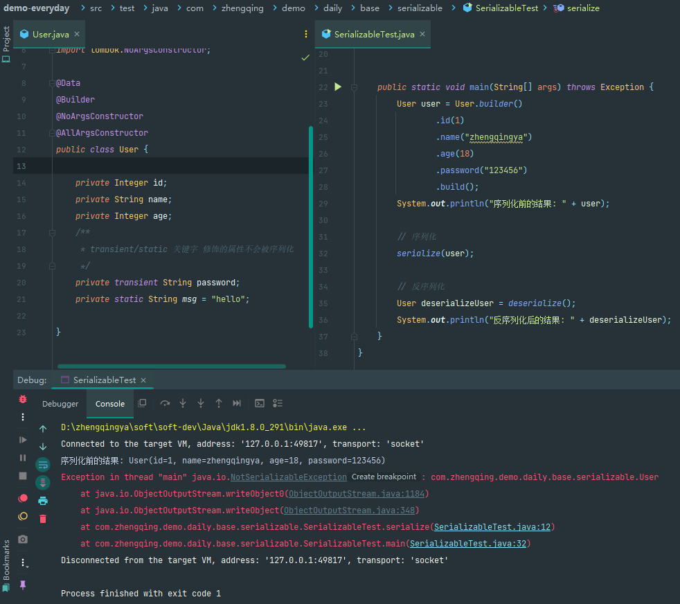
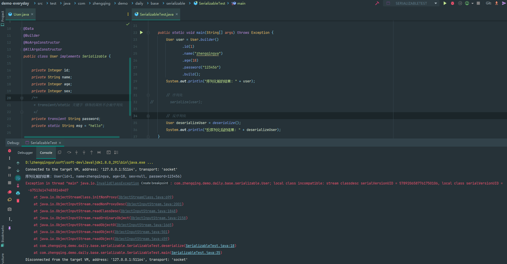

# 序列化和反序列化

1. 序列化：将java对象转换为字节序列保存到磁盘文件中的过程。
2. 反序列化：将保存在磁盘文件中的java字节序列恢复为java对象的过程。

```java
import lombok.AllArgsConstructor;
import lombok.Builder;
import lombok.Data;
import lombok.NoArgsConstructor;

import java.io.Serializable;

@Data
@Builder
@NoArgsConstructor
@AllArgsConstructor
public class User implements Serializable {

    private static final long serialVersionUID = 1L;

    private Integer id;
    private String name;
    private Integer age;
    /**
     * transient/static 关键字 修饰的属性不会被序列化
     */
    private transient String password;
    private static String msg = "hello";

}
```

```java
import java.io.File;
import java.io.ObjectInputStream;
import java.io.ObjectOutputStream;
import java.nio.file.Files;

public class SerializableTest {

    private static void serialize(User user) throws Exception {
        ObjectOutputStream oos = new ObjectOutputStream(Files.newOutputStream(new File("./test.txt").toPath()));
        oos.writeObject(user);
        oos.close();
    }

    private static User deserialize() throws Exception {
        ObjectInputStream ois = new ObjectInputStream(Files.newInputStream(new File("./test.txt").toPath()));
        return (User) ois.readObject();
    }


    public static void main(String[] args) throws Exception {
        User user = User.builder()
                .id(1)
                .name("zhengqingya")
                .age(18)
                .password("123456")
                .build();
        System.out.println("序列化前的结果: " + user);

        // 序列化
        serialize(user);

        // 反序列化
        User deserializeUser = deserialize();
        System.out.println("反序列化后的结果: " + deserializeUser);
    }
}
```

##### 验证测试为什么Java需要序列化和反序列化

###### 测试1

先不实现`Serializable`，
序列化时会报错：`Exception in thread "main" java.io.NotSerializableException: com.zhengqing.demo.daily.base.serializable.User`



###### 测试2

实现`Serializable`，
先序列化，然后新增字段`sex`，
注释序列化，反序列化时会报错：`Exception in thread "main" java.io.InvalidClassException: com.zhengqing.demo.daily.base.serializable.User; local class incompatible: stream classdesc serialVersionUID = 5789206587761750106, local class serialVersionUID = -6751361474838148407`

> 即：序列化与反序列化时产生的`serialVersionUID`不一致。



###### 测试3

实现`Serializable`，并指定`serialVersionUID`，再复测以上问题，成功解决。

