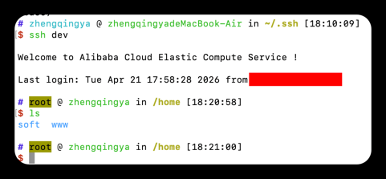

# ssh

mac通过终端连接

```shell
# 1、将 xx.pem 私钥文件放到 ~/.ssh/ 目录下，方便管理
# 修改权限，仅本人可读
# chmod 400 ~/.ssh/xxx.pem

# 2、创建配置文件 & 配置
touch ~/.ssh/config

# 3、尝试连接服务器
ssh dev
```

`~/.ssh/config`配置示例

```config
# 全局设置：对所有 Host 生效
Host *
    ServerAliveInterval 60    # 每 60 秒发一次心跳，防止连接断开
    ServerAliveCountMax 3     # 连续 3 次心跳失败才断开
    ConnectTimeout 10         # 连接超时时间
    StrictHostKeyChecking no  # 第一次连接自动接受指纹（省去输入 yes 的步骤，适合内网环境）

# ---------------------------------------------------------------------------------

# 开发环境
Host dev                             # 给你的服务器起个“外号”（比如 dev）
    HostName 192.168.xx.xx           # 填入你服务器的真实公网 IP
    User root                        # 登录用户名（通常是 root）
    IdentityFile ~/.ssh/dev_key.pem  # 指向你下载的私钥路径

# 测试环境
Host test
    HostName 192.168.xx.xx
    User root
    IdentityFile ~/.ssh/test_key.pem
```


