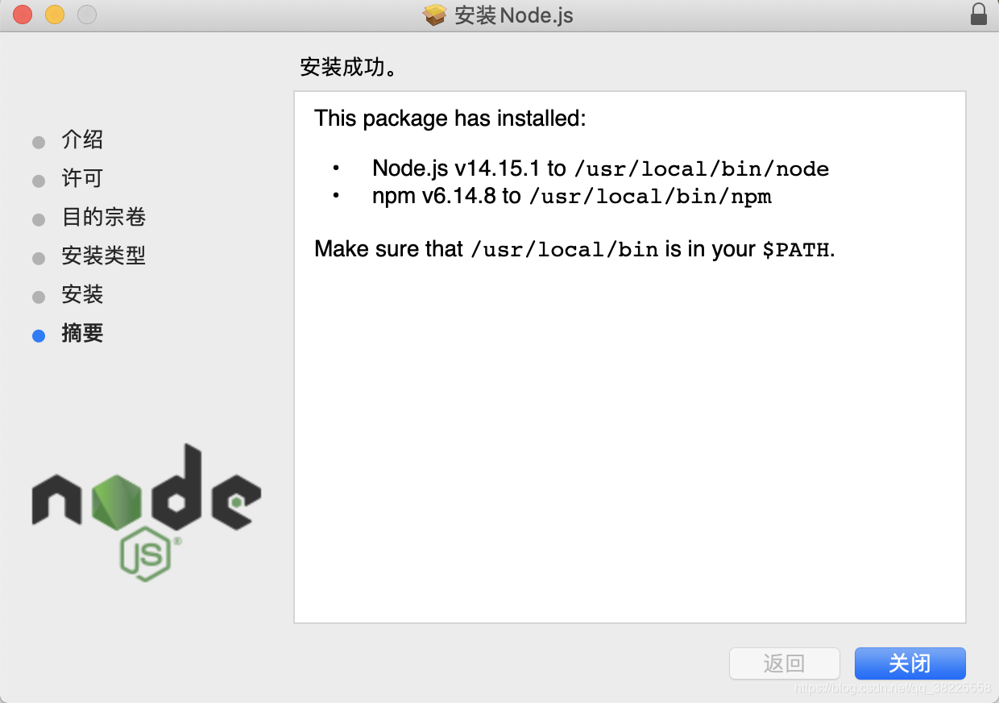

# Node.js

> [https://nodejs.org/en](https://nodejs.org/en)

下载安装  https://nodejs.org/zh-cn/download/



```shell
# 查看版本
npm -v

# npm 升级
npm install -g npm

# 设置淘宝`NPM`镜像
sudo npm install -g cnpm --registry=https://registry.npm.taobao.org
# 测试
cnpm -v

# 查看node安装路径
where node
```

### 卸载

```shell
sudo rm -rf /usr/local/{bin/{node,npm},lib/node_modules/npm,lib/node,share/man/*/node.*}
```
