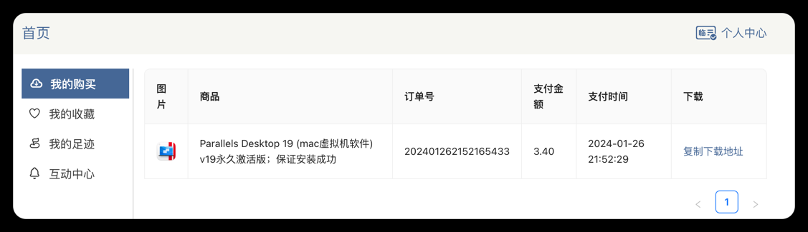
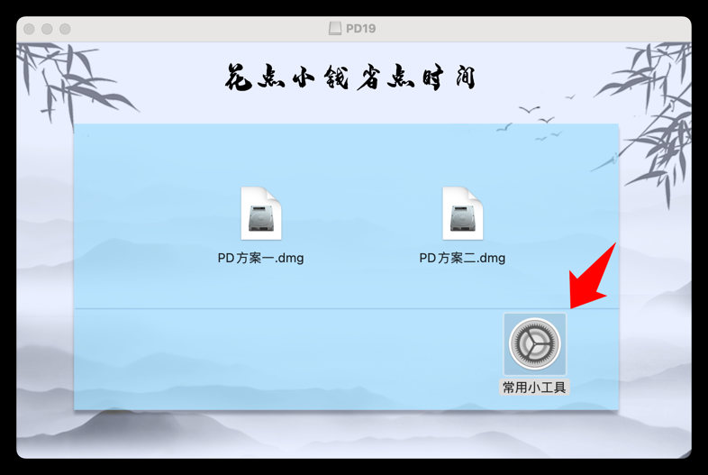
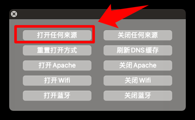
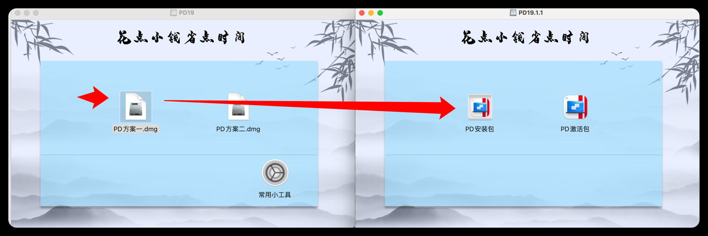
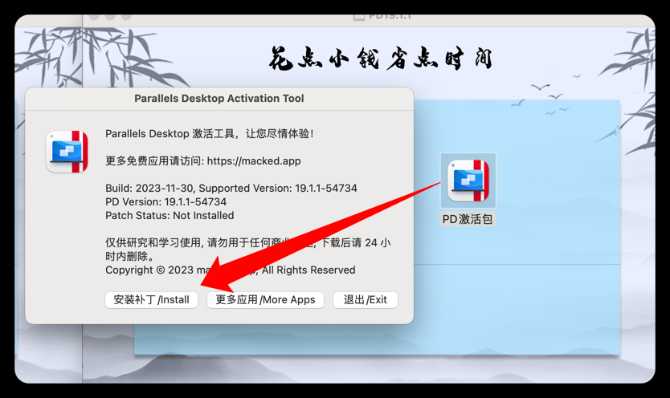
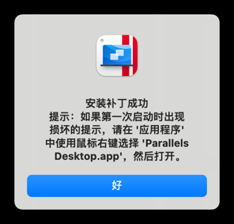
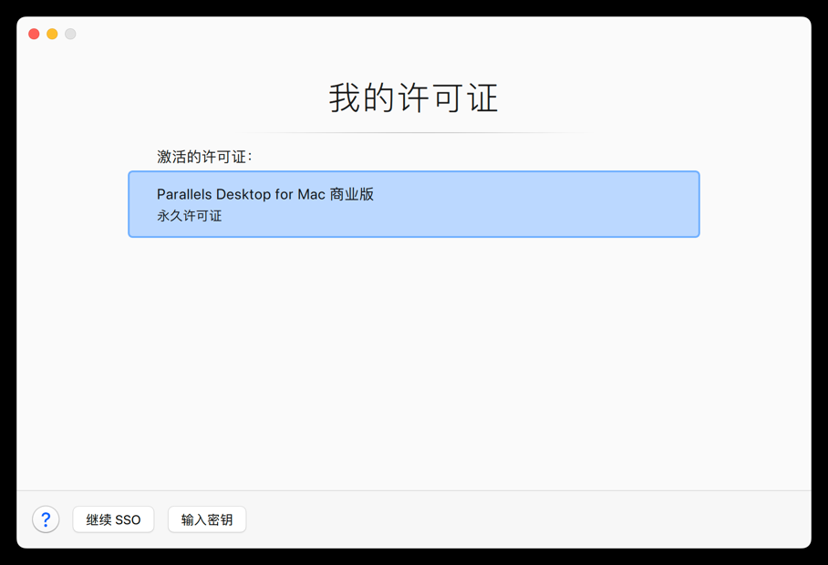

# Parallels Desktop

> 不重启在mac上运行windows应用程序
> windows/centos 虚拟机

[https://www.parallels.cn/products/desktop/download/](https://www.parallels.cn/products/desktop/download/)

### Parallels Desktop 19 破解版

#### 方式一

https://macwk.cn/app/532.html

安装后破解

> 我这里失败了...

```shell
chmod -R 777 Crack_Parallels
cd Crack_Parallels
./Install_Patch.command
```

#### 方式二

https://mp.weixin.qq.com/s/qdk3zN48TN-BAjzNxWcIRg

会收费40，没试过...

#### 方案三

https://www.bilibili.com/video/BV1pa4y1z7JF

> 已尝试，成功版

会收费3.4


双击 `PD19.dmg`

如果无法正常打开，需要在mac的`系统设置`->`隐私与安全`->选择`任要打开`

然后进行安装

点击PD激活包 -> 安装补丁


然后退出补丁，重新打开PD，查看激活情况



