@[TOC](文章目录)

### 一、前言

本文将通过`Parallels Desktop`安装`Windows10专业版`

### 二、准备

1. Parallels
   Desktop下载安装 [https://www.parallels.cn/products/desktop/download](https://www.parallels.cn/products/desktop/download)
2. win10镜像下载 [https://www.microsoft.com/zh-cn/software-download](https://www.microsoft.com/zh-cn/software-download)

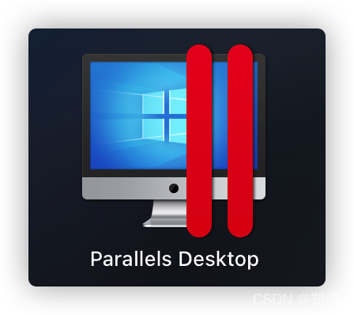

### 三、`Parallels Desktop`安装`Windows10专业版`

> tips: 安装很简单，跟着提示一步一步操作即可，这里简单贴出安装过程图~

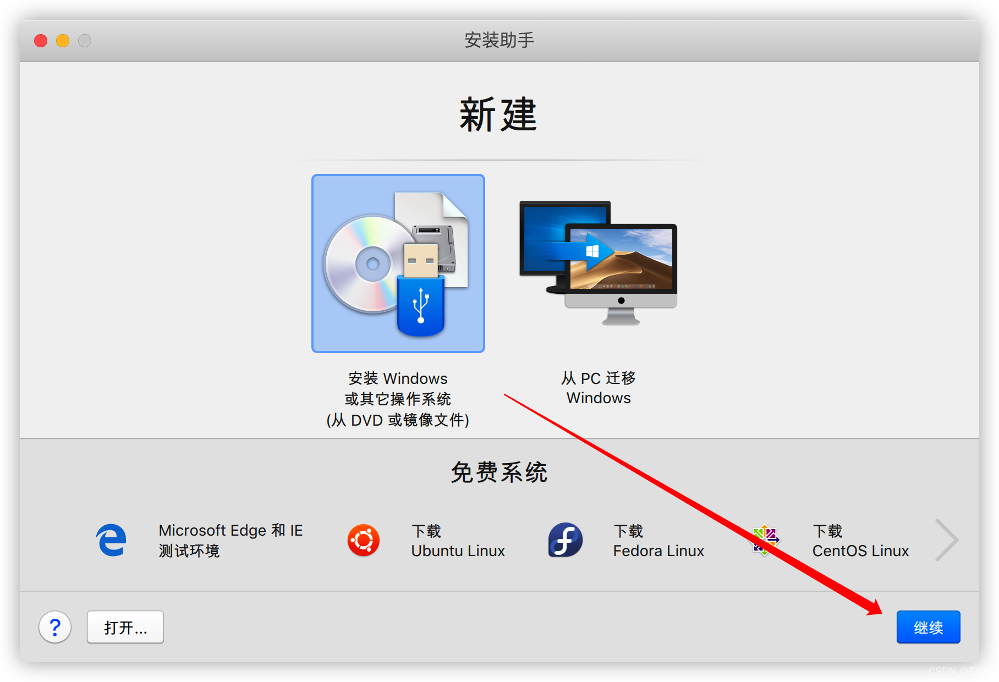
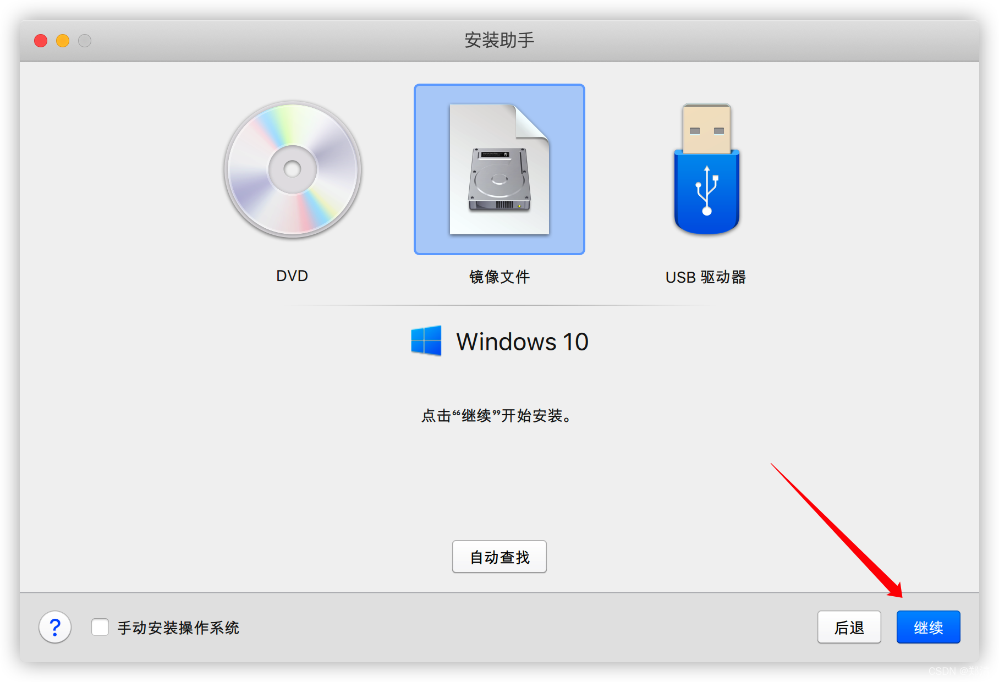
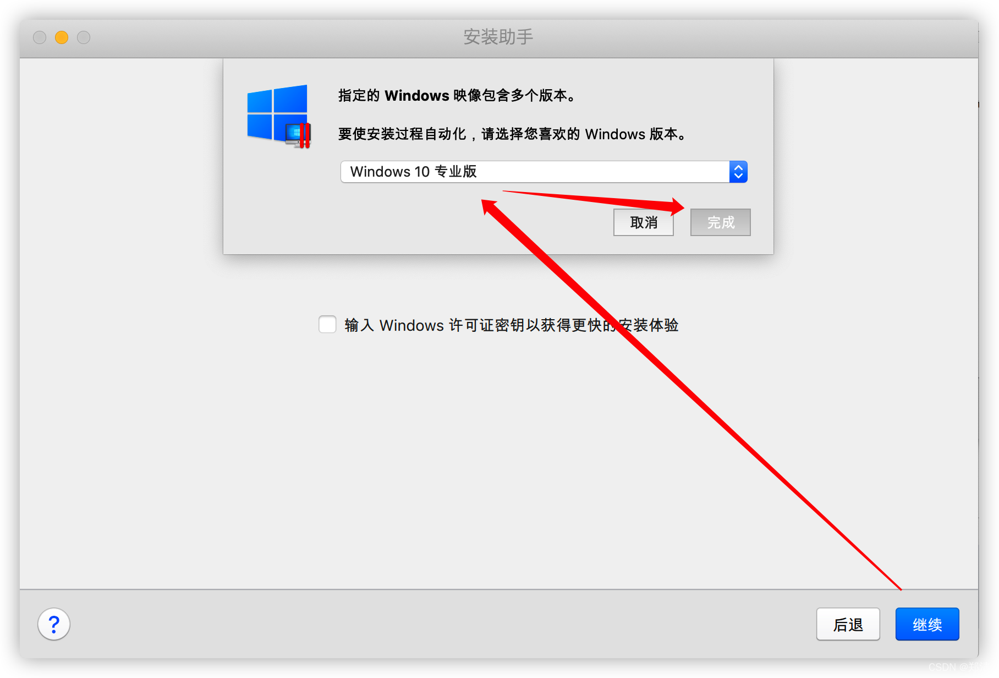
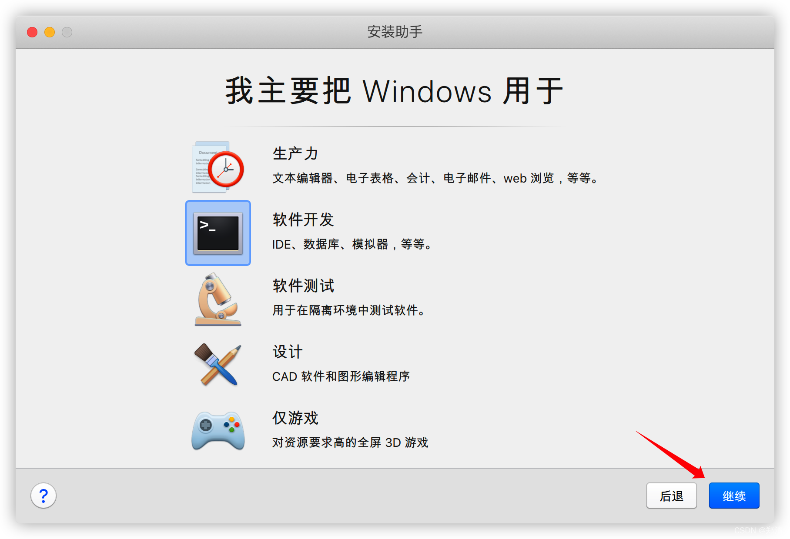
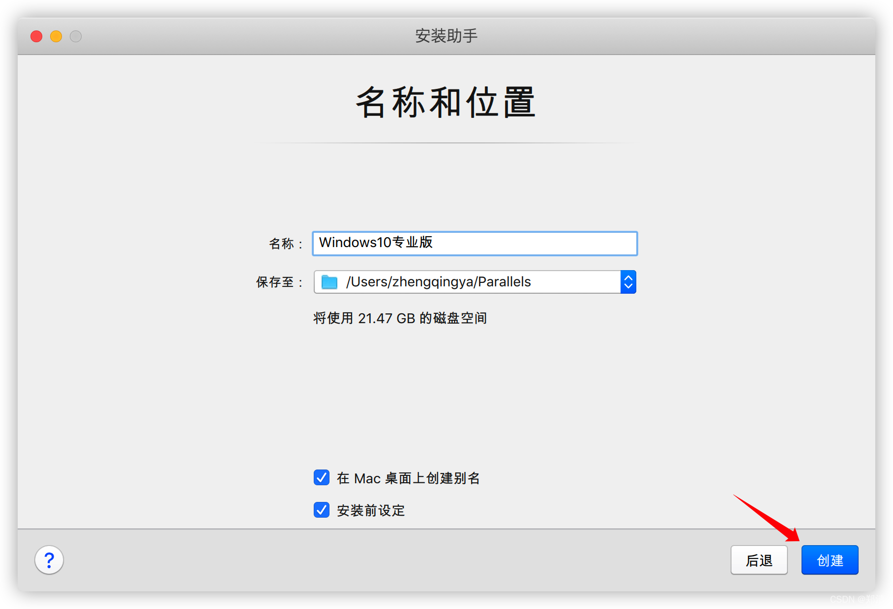
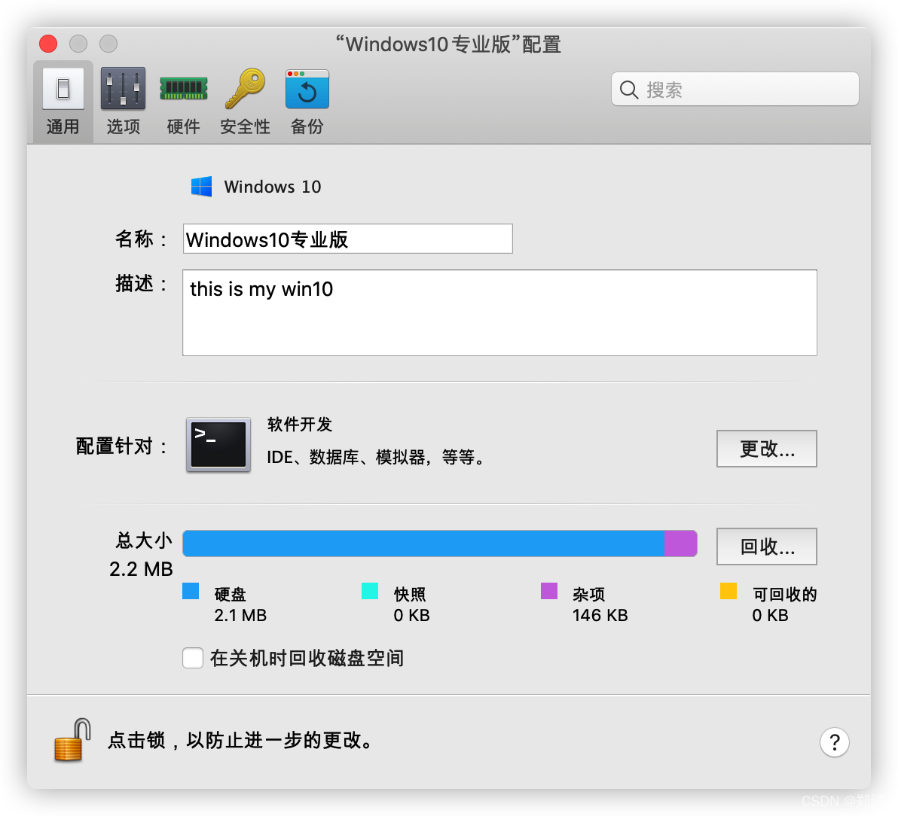
根据自己的条件进行配置即可
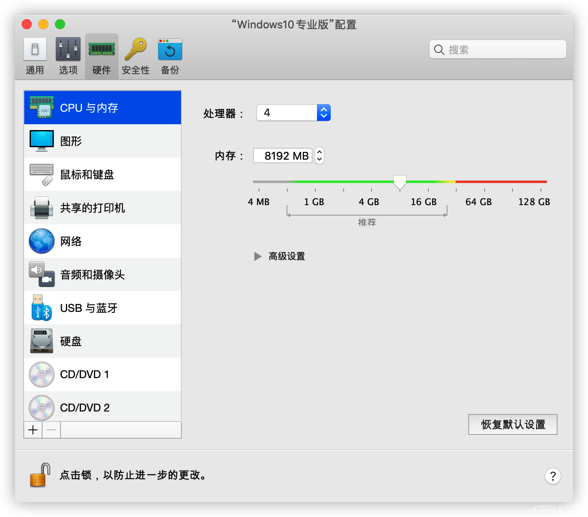

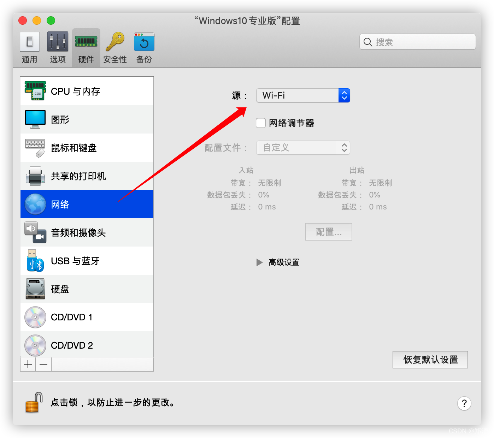
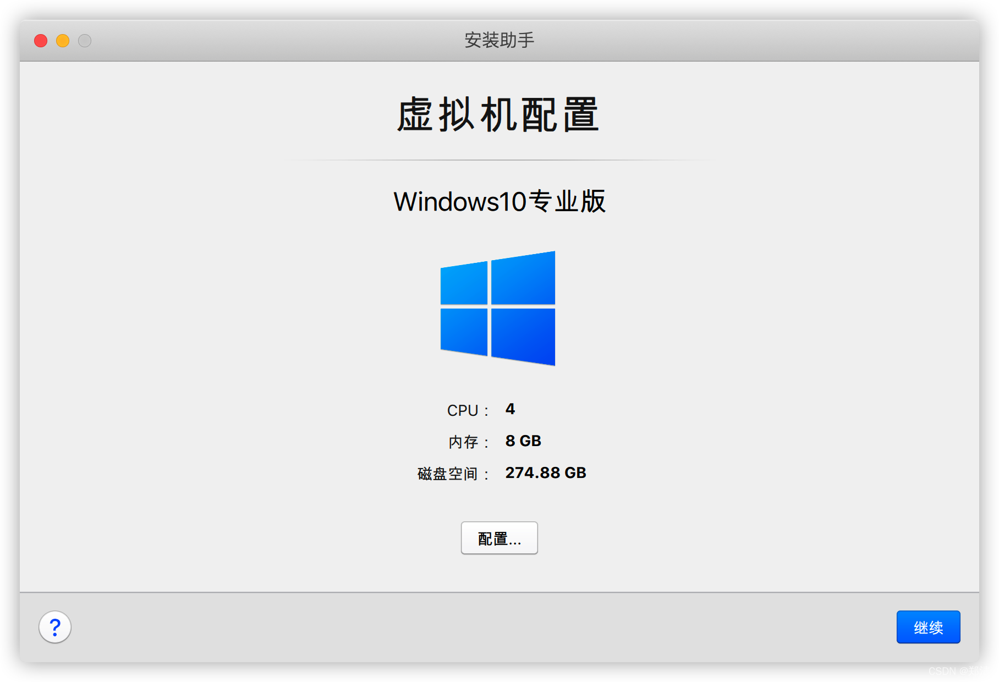
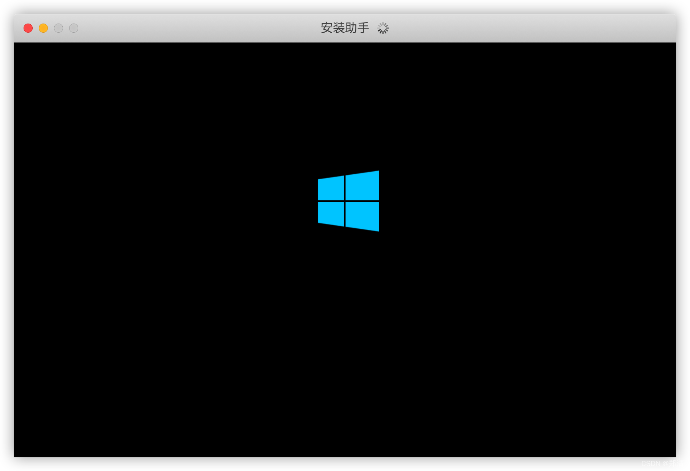
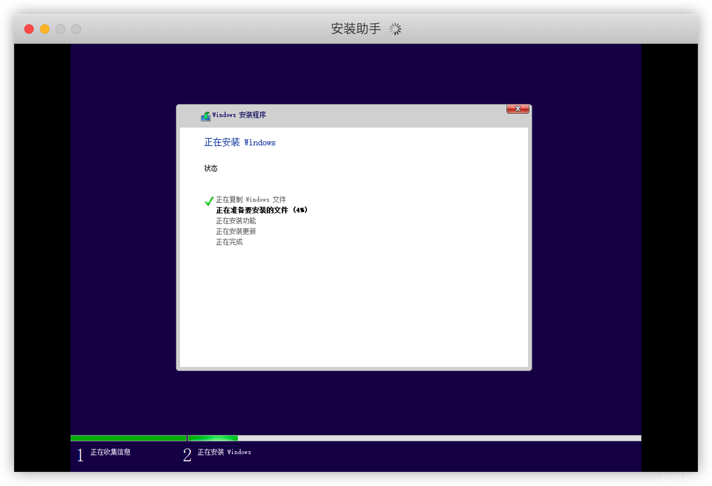

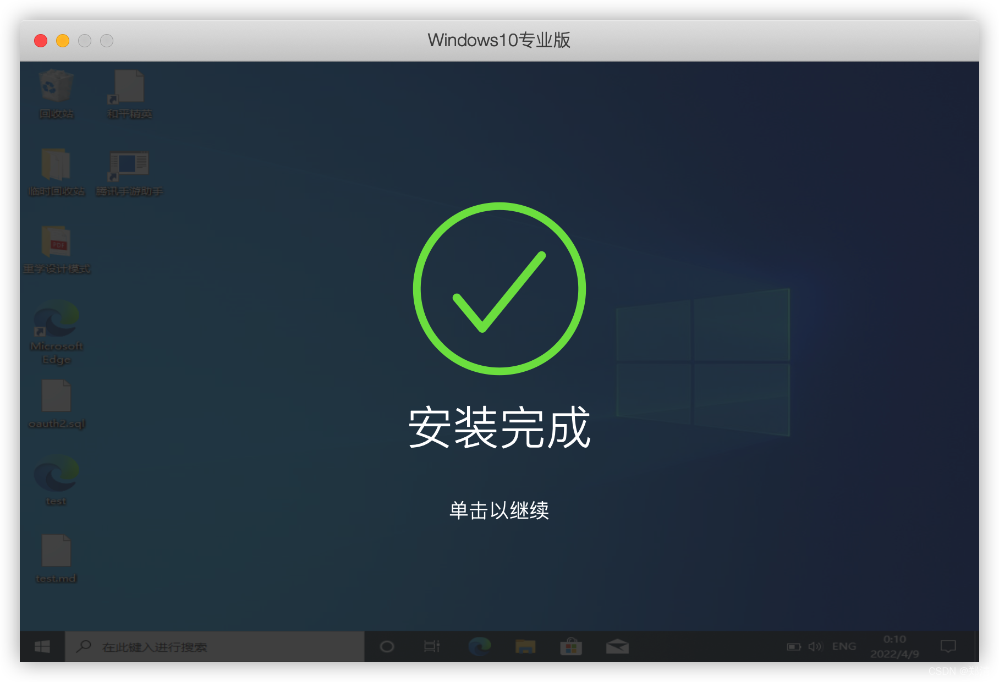
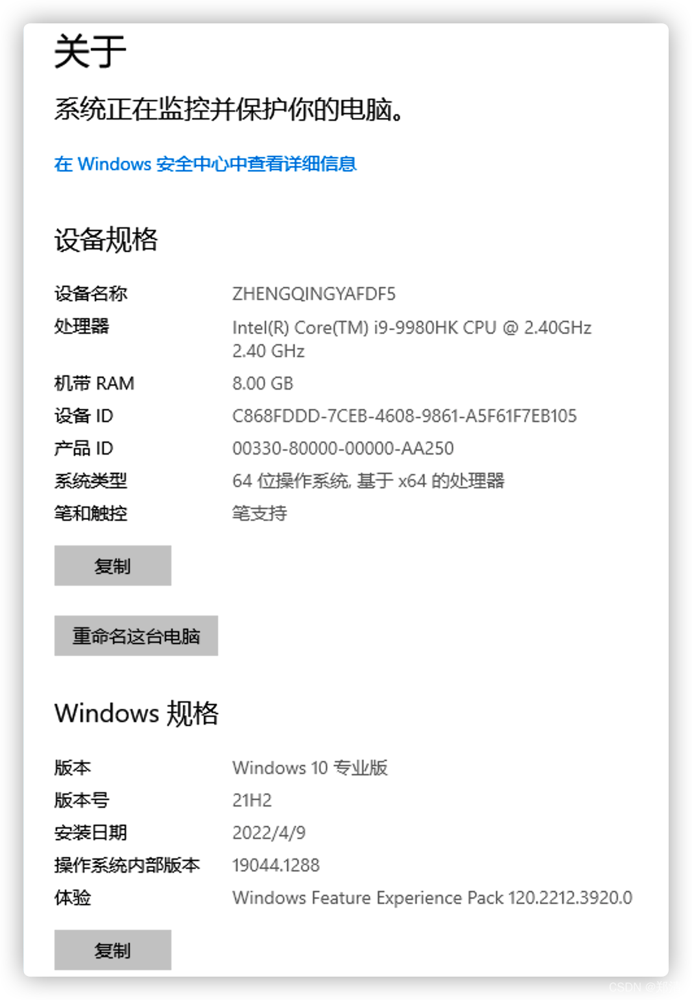
安装到此完成`^_^`
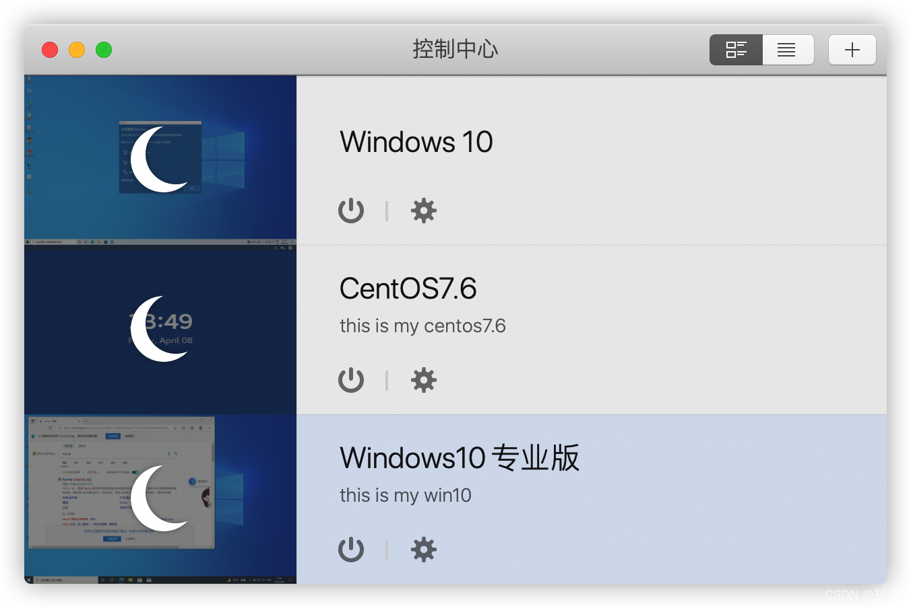

--- 

> 今日分享语句：
> 成功没有快车道，幸福没有高速路。所有的成功，都来自不倦地努力和奔跑，所有的幸福都来自平凡的奋斗和坚持。
