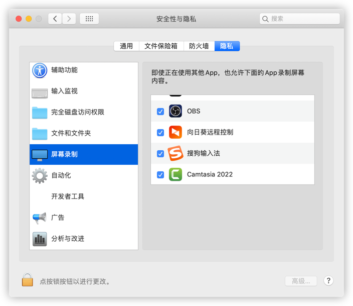
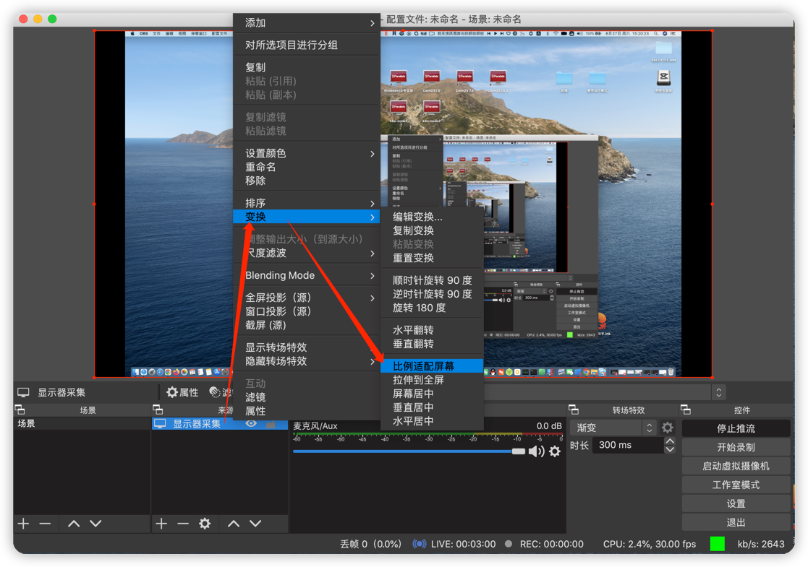
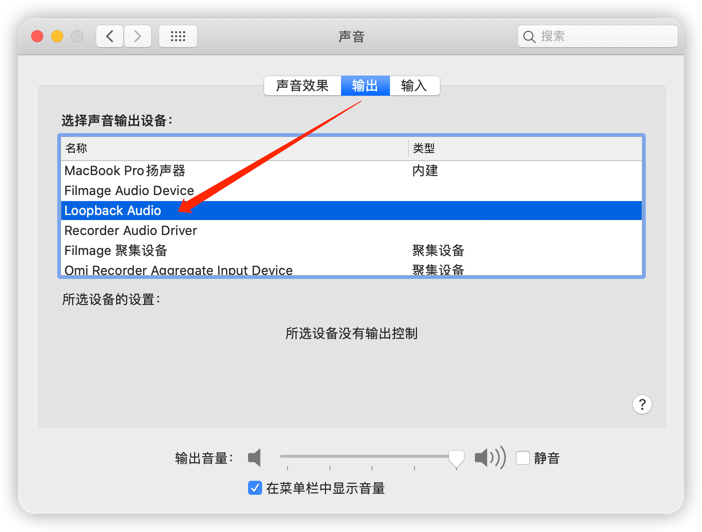
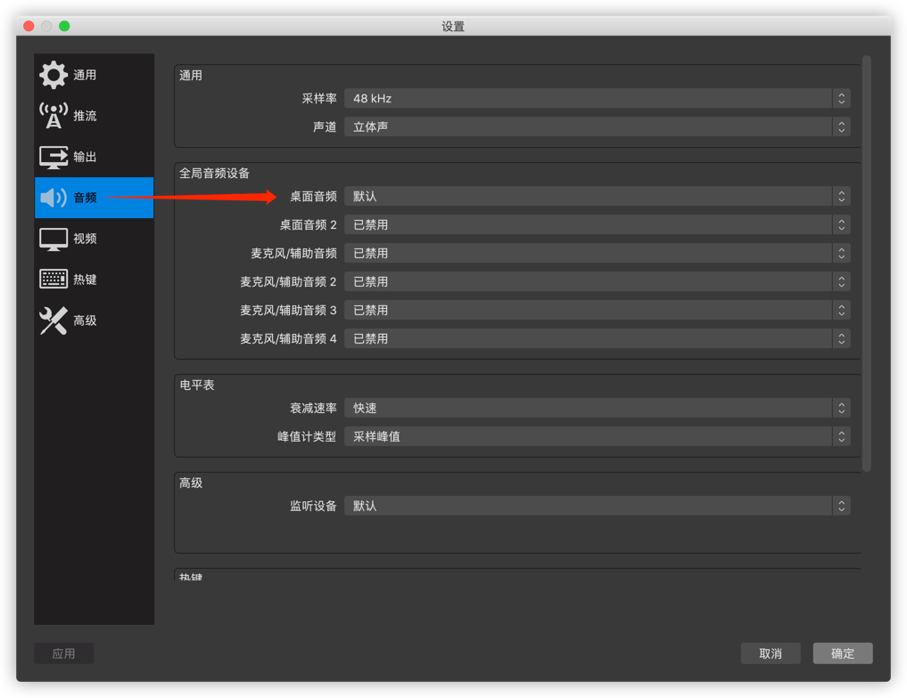
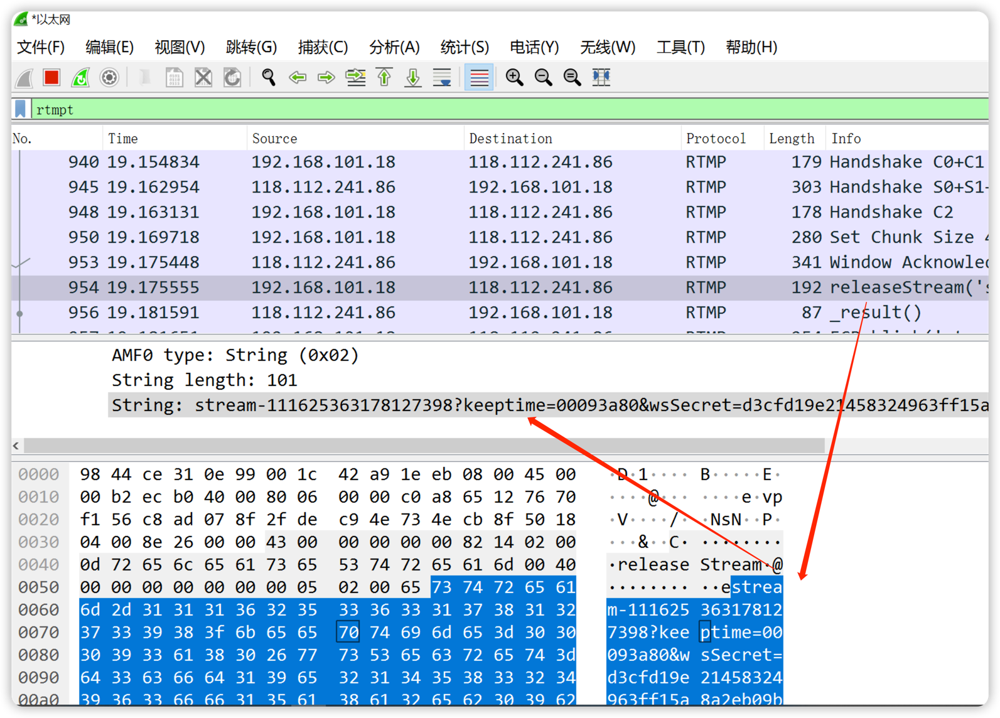

### OBS

直播录像

https://obsproject.com
https://www.macwk.com/soft/obs-studio

开启录屏权限
`系统偏好设置` -> `安全性与隐私` -> `屏幕录制` -> 勾选OBS



全屏录制


音频录制需要依靠`Loopback`软件，并在`系统偏好设置` -> `声音` -> `输出` -> 从`MacBook Pro扬声器`选择修改为`Loopback Audio`


在obs设置中修改音频


之后就可以看见音频在动了


### windows获取抖音推流码

需在windows上安装`Win10Pcap` 和 `Wireshark`

服务器


串流密钥


### 问题: 电脑内置声音输出&麦克风输入声音都没有

> 问题环境：`macOS 10.15 Catalina` +  `OBS_27.2.0-rc1.dmg`
> 解决：
>   - 建议下载最新版obs  "obs-studio-28.1.1-macos-x86_64.dmg"
>   - 或使用下面命令启动obs

```shell
open /Applications/OBS.app/Contents/MacOS/OBS --args -picture
```
