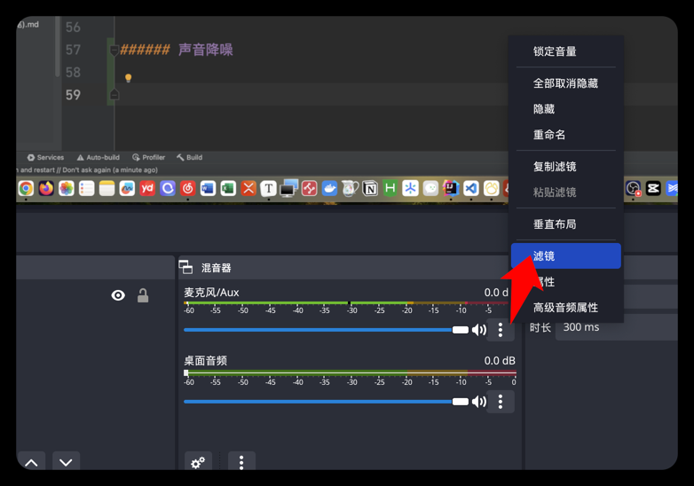
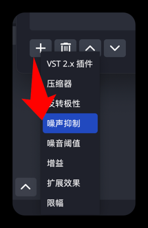
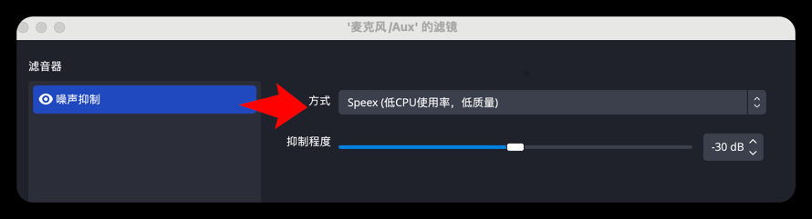
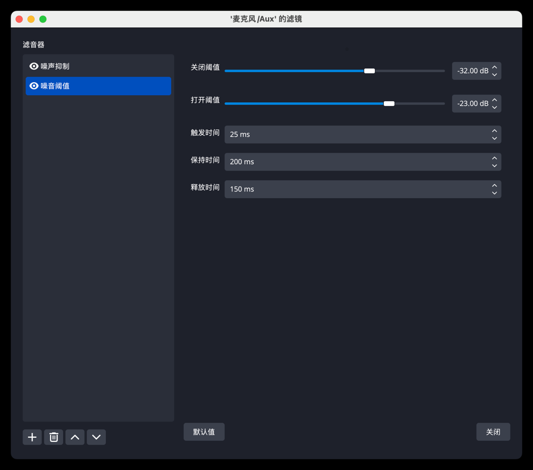

### OBS

直播录像

https://obsproject.com
https://www.macwk.com/soft/obs-studio

开启录屏权限
`系统偏好设置` -> `安全性与隐私` -> `屏幕录制` -> 勾选OBS


全屏录制


音频录制需要依靠`Loopback`软件，并在`系统偏好设置` -> `声音` -> `输出` -> 从`MacBook Pro扬声器`选择修改为`Loopback Audio`


在obs设置中修改音频


之后就可以看见音频在动了


### windows获取抖音推流码

需在windows上安装`Win10Pcap` 和 `Wireshark`

服务器


串流密钥


### 问题: 电脑内置声音输出&麦克风输入声音都没有

> 问题环境：`macOS 10.15 Catalina` +  `OBS_27.2.0-rc1.dmg`
> 解决：
>   - 建议下载最新版obs  "obs-studio-28.1.1-macos-x86_64.dmg"
>   - 或使用下面命令启动obs

```shell
open /Applications/OBS.app/Contents/MacOS/OBS --args -picture
```

--- 

### 抖音直播步骤：

1. 直播伴侣开启直播
2. 推流码获取
3. obs 推流码信息填写
4. 直播伴侣退出（不要关播）
5. obs 开启直播
6. 最后关闭时： 1、obs关播 2、直播伴侣重新打开后关闭直播

###### 声音降噪

麦克风 -> 滤镜


左下角添加 -> 噪音抑制


噪音阈值 -> 打开阈值（不要拉满，否则没声音）


###### 插件中心

> 目前mac上没有看见有这个配置

https://www.obsworks.com/center/

弹幕显示插件使用教程 https://docs.qq.com/doc/DS0FZSkduZk5FdHNr

