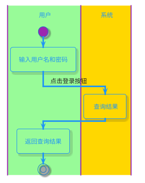
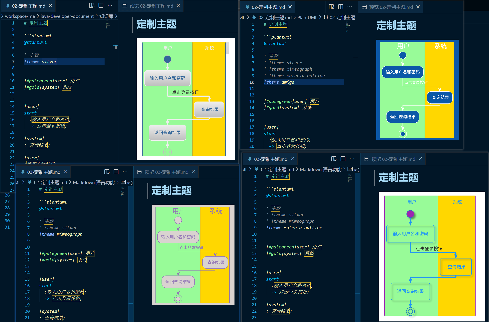

# 定制主题

### 方式一：PlantUML自带

效果预览：

### 方式二：C4 模型及其自定义 PlantUml 渲染主题

- https://github.com/xuanye/plantuml-style-c4
- [看这个] https://gitee.com/rdor/my-uml
  - 见 [custom-style-c4](./custom-style-c4)

自定义的plantuml 样式。
