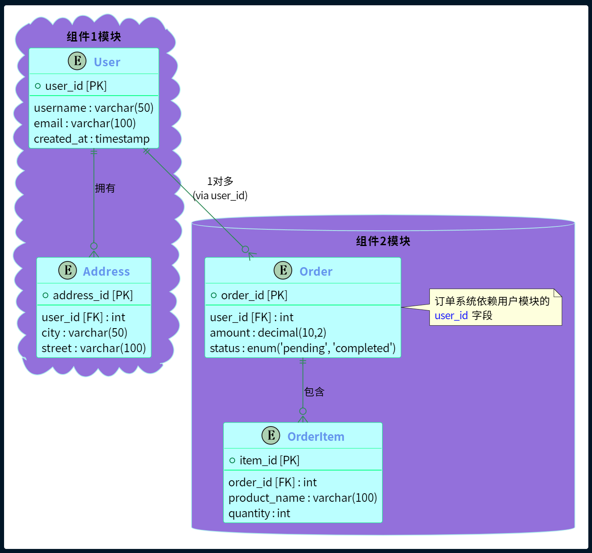

# PlantUml模块化拆分展示

[main.puml](./project/main.puml)

目录结构：

```
project/
├── styles/
│   └── common.puml      # 定义通用元素（样式、宏等）
├── components/
│   ├── component1.puml  # 组件1定义
│   └── component2.puml  # 组件2定义
└── main.puml            # 主文件
```

### 最终效果图



