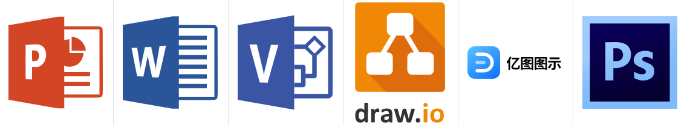
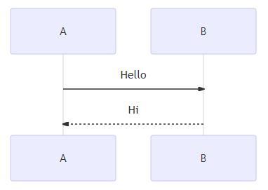
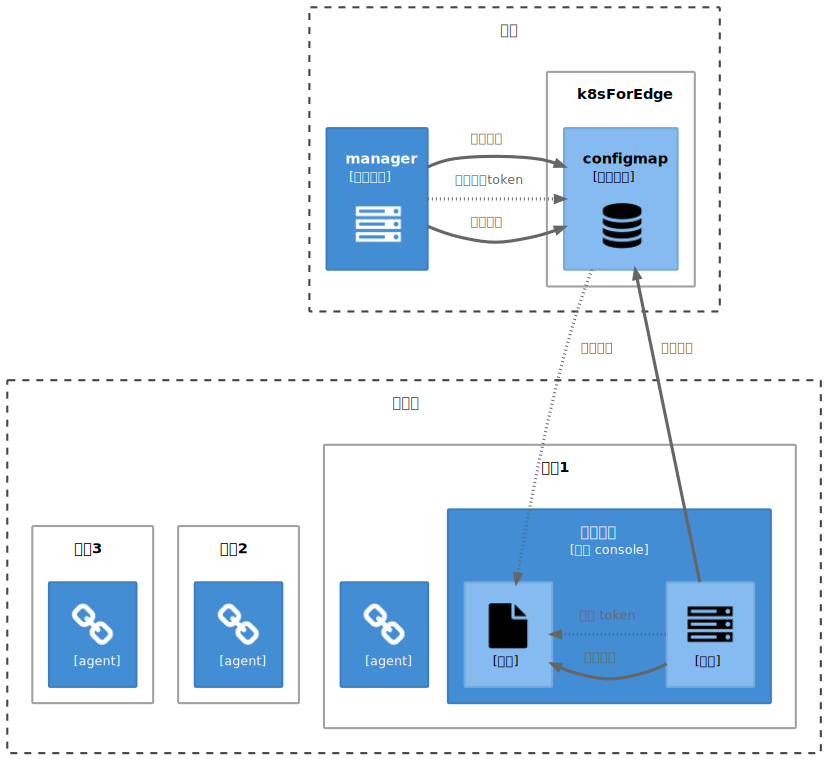
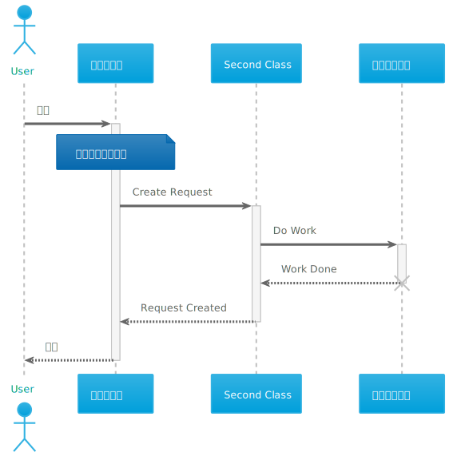
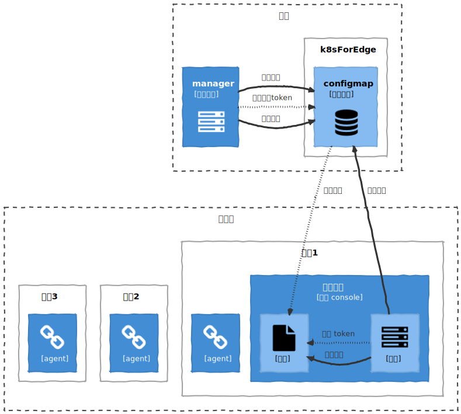
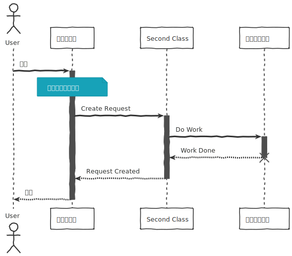

C4 模型及其自定义 PlantUml 渲染主题。

## 程序员画图二三事

###  选择画图工具
工具可以分成如下两个派系：

#### 鼠标拖拽系



> 我见过用 ppt 画图的架构师，理论上 word 也一样可以~
>
> 其中 Visio 和 亿图图示画流程图等比较专业，不完全免费。
> 
> PhotoShop 不多说，可以画非常精细的图。


#### 键盘编码系

比鼠标拖拽系，优点非常突出：不用太操心渲染和布局，非常方便修改。

下边推荐的 Mermaid 和 Plantuml 都是免费且开源的，绘图语法相当精简，体验类似用 markdown 写文章。


##### [Mermaid 美人鱼图](https://mermaid-js.github.io/mermaid/#/)

基于 `js` 构建的绘图工具。可以直接在 markdown 文档里像写代码一样画图，如：

    ```mermaid
    sequenceDiagram
    A ->> B: Hello
    B -->> A: Hi
    ```


渲染如下：



Mermaid 支持流程图、时序图、类图、状态图、实体关系图、用例图、甘特图、饼图等。不支持图片导出。

源码地址： https://github.com/mermaid-js/mermaid

##### [PlantUml 植物模型图](https://plantuml.com/zh)

基于 `java` 构建的开源绘图工具。同样是用编码的方式绘图。可下载官方 `jar` 包配合 `graphviz-dot` 使用，也可以在文本编辑工具里集成插件，支持各种 IDE， 甚至 word。比 `mermaid` 支持更多种类的图形绘制，更灵活、强大，支持导出 `svg` 和 `png` 图片。

源码地址： https://github.com/plantuml/plantuml

### 选定主角 plantuml
语法不用强记，用的时候查看就行。官网：https://plantuml.com/zh

标准库值得挖掘，下边推荐的 C4 及 bluegray、sketchy-outline 主题都来自于标准库。

### 统一绘图风格

推荐 C4 模型及其自定义 PlantUml 渲染主题。

- 什么是 C4 模型？

> C4 模型是一个标准，让架构师、程序员、业务人员在讨论 IT 系统架构时候统一标准，更方便的理解和沟通。

> C4 模型从大到小把软件系统看作四个层次：系统上下文（System Context）、容器(Container)、组件(Component)和代码(Code)。
>
> 我用本项目的plantuml样式画了示意图，如下：
>
> 
> 
> 更多内容，参考 [C4 Model官网](https://c4model.com) 。

根据平时工作，对 plantuml 标准库主题做了微调，形成了这个小项目。

System context、Container 和 Component 层参考了 https://github.com/plantuml-stdlib/C4-PlantUML 。

Code 层参考了 https://github.com/bschwarz/puml-themes ，对其 bluegray、sketchy-outline 主题做了微调。

#### 示例
System context、Container 和 Component 层:

```
@startuml

!include ../C4/Component.puml
!include ../C4/Deployment.puml
!include <tupadr3/font-awesome/file>
!include <tupadr3/font-awesome/server>
!include <tupadr3/font-awesome/chain>
!include <tupadr3/font-awesome/database>

'Sketch()

hide stereotype

Boundary(hwcloud, "云端") {
    Container(manager, manager, 管理服务, <$server>)
    DeployNode(ief, k8sForEdge) {
        Component(cm, configmap, 消息通道, <$database>)
    }
}

Boundary(edge, "边缘侧") {
    DeployNode(node1, 节点1) {
        Container(wnode1, <$chain>, agent)
        Container(proxy, 代理服务, 自带 console) {
            Component(backend, <$server>, 后台)
            Component(file, <$file>, 挂载)
        }
    }
    DeployNode(node2, 节点2) {
        Container(wnode2, <$chain>, agent)
    }
    DeployNode(node3, 节点3) {
        Container(wnode3, <$chain>, agent)
    }
}

manager ~>> cm : 定时更新token

Rel_R(manager, cm, 写入请求)
Rel_R(manager, cm, 读取响应)

cm ~~>> file : 挂载文件

Rel_L(backend, file, 轮询消息)
file <<~ backend : 获取 token

Rel_U(backend, cm, 响应结果)

@enduml

```

渲染效果：



> system context、container 和 component 也可以直接使用标准库; 导入方式如下：
> `!include <C4/Deployment>`
> 渲染效果和本库略有不同，且没有 code 层的实现。

Code 层的示例，如：

```
@startuml sequence-sample

!include ../C4/Code.puml

'Sketch()

actor User
participant "第一个家伙" as A
participant "Second Class" as B
participant "最后一个家伙" as C

User -> A: 干活
activate A
note over A: 这是一条注释说明
A -> B: Create Request
activate B

B -> C: Do Work
activate C
C --> B: Work Done
destroy C
'deactivate C

B --> A: Request Created
deactivate B

A --> User: 收工
deactivate A

@enduml
```



#### 草图风格
可以使用 Sketch() 函数绘制草图，如上面两幅图草图渲染效果如下：





#### 更多示例
> 详见[samples](./samples/) 目录

#### License
MIT
