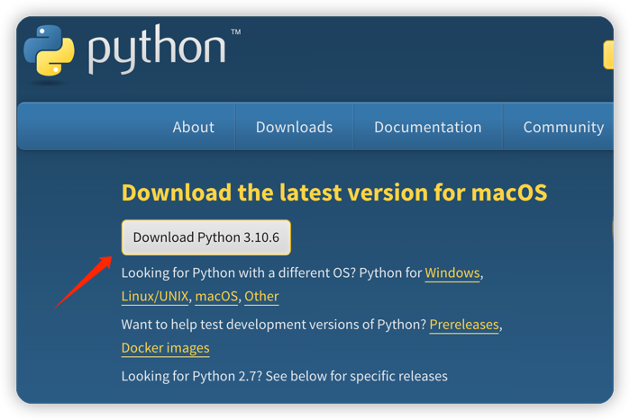
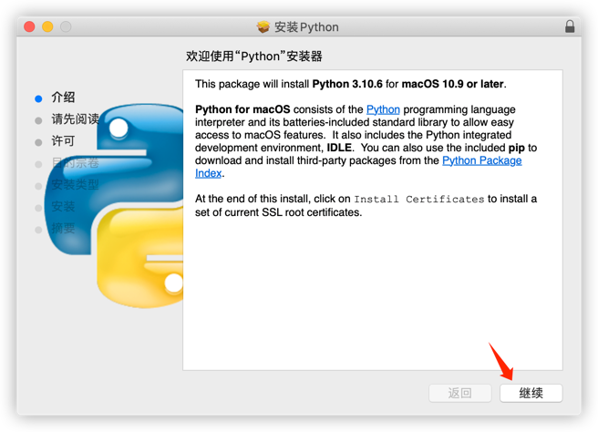
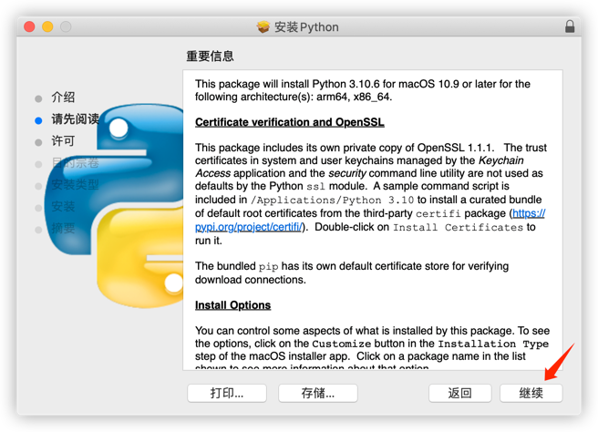
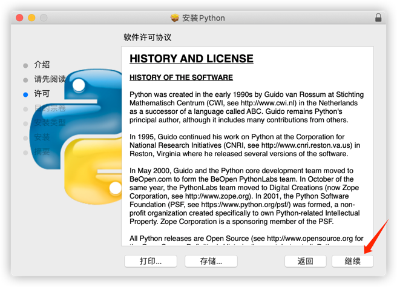
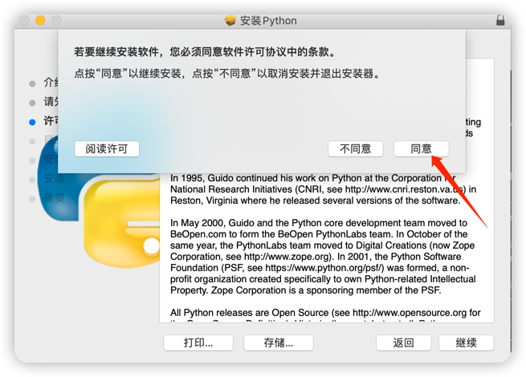
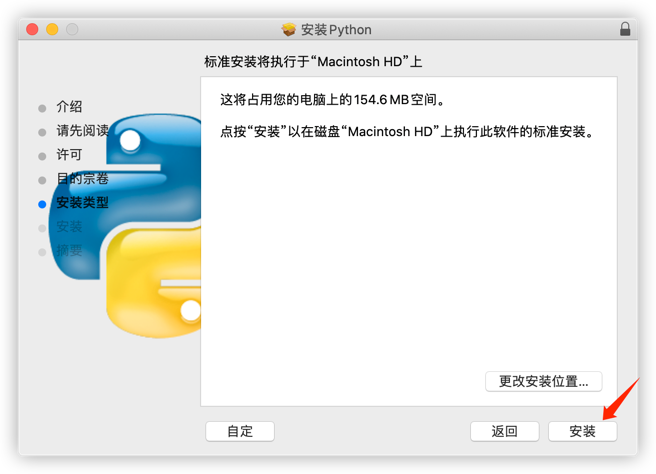
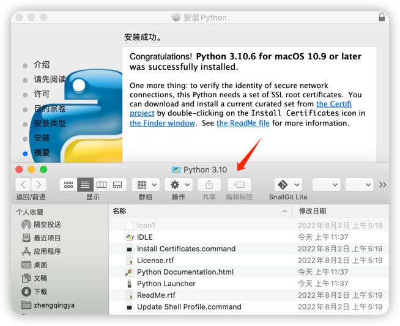
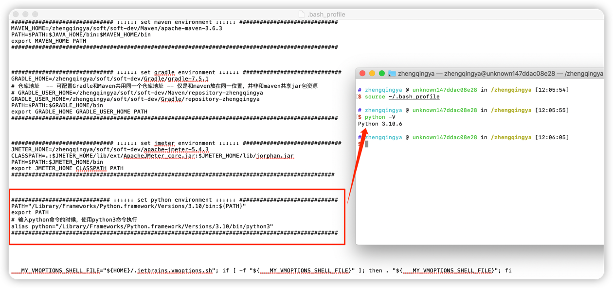

### Mac上安装Python环境

下载解释器地址 https://www.python.org/downloads



安装





安装完成


### 配置

```shell
# python3安装路径
/Library/Frameworks/Python.framework/Versions/3.10
# 查看版本
/Library/Frameworks/Python.framework/Versions/3.10/bin/python3 -V


# 配置python3环境变量
open ~/.bash_profile

############################# ↓↓↓↓↓↓ set python environment ↓↓↓↓↓↓ #############################
PATH="/Library/Frameworks/Python.framework/Versions/3.10/bin:${PATH}"
export PATH
# 输入python命令的时候，使用python3命令执行
alias python="/Library/Frameworks/Python.framework/Versions/3.10/bin/python3"
################################################################################################


# 使配置生效
source ~/.bash_profile

# 验证
python -V
```


