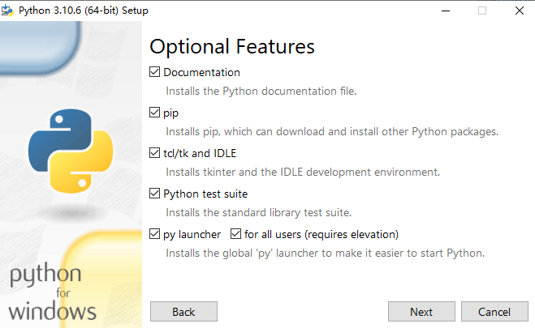
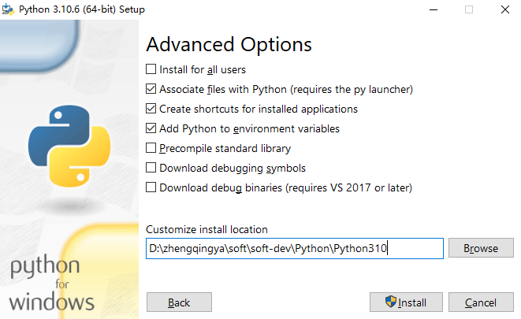

### Python解释器安装

下载解释器 https://www.python.org/downloads


双击`python-3.10.6-amd64.exe`进入，选择自定义安装




安装位置 `D:\zhengqingya\soft\soft-dev\Python\Python310`


安装完成后点击`禁用系统的path长度自动限制` => 避免麻烦


安装结束


> `python.exe`：解释器程序


---

验证

> win+r 输入 cmd 进入命令行

```shell
python -V
```

