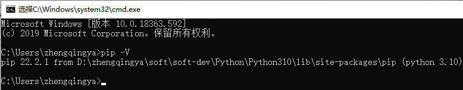

# pip

pip用来管理python包

`D:\zhengqingya\soft\soft-dev\Python\Python310\Scripts\pip.exe`

```shell
# 查看版本
pip -V

# 升级pip
python.exe -m pip install --upgrade pip

# 安装包
pip install 包名称
# 安装指定版本的包
pip install 包名称==1.0

# 卸载包
pip uninstall 包名称

# 查看包信息
pip show 包名称

# 更新包
pip install --upgrade 包名称
# 或
pip install -U 包名称

# 查看安装的包
pip list
# 查看需要被升级的包
pip list -o
```


