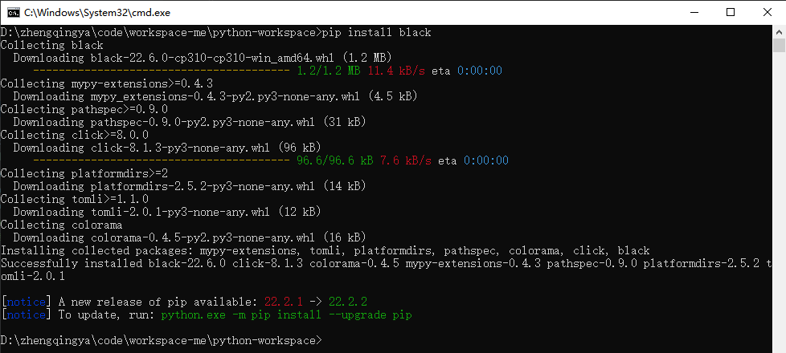
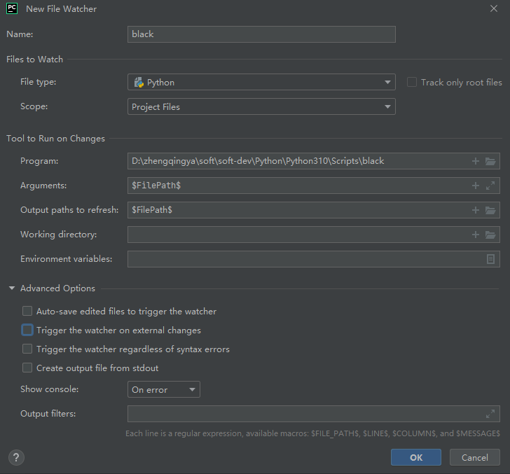
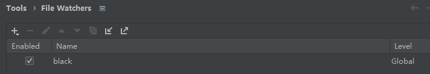

### 保存时自动格式化代码

安装插件`File Watchers`

> 我这里的pycharm版本自己默认安装好了...


安装`black`包

```shell
pip install black
```



安装好之后，python解释器所在目录的Scripts目录下会多出一个`black.exe`文件

> D:\zhengqingya\soft\soft-dev\Python\Python310\Scripts\black.exe

pycharm中添加监听器

`File` -> `New Projects Setup` -> `Settings for New Projects...` -> `Tools` -> `File Watchers`

> Program选择上面的`black.exe`文件路径





之后`ctrl+s`即可自动格式化代码