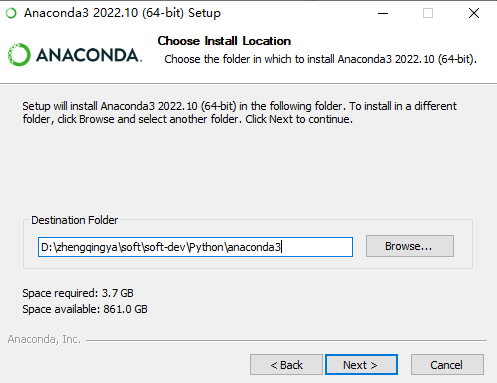
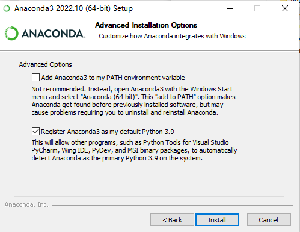

# 安装Conda

- `Miniconda` -- 简洁版（命令行+最小环境）
- `Anaconda` -- 增强版（图形化+很多其它环境包资源，体积大）

### Anaconda方式安装Conda

> 可参考 https://docs.conda.io/projects/conda/en/stable/user-guide/install/windows.html

官网下载 https://www.anaconda.com/products/distribution

> ex: https://repo.anaconda.com/archive/Anaconda3-2022.10-Windows-x86_64.exe

双击`.exe`文件进行安装 (选择安装位置)

安装完成后，从`开始`菜单中打开`Anaconda`

