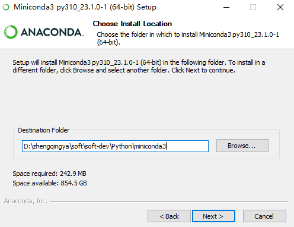
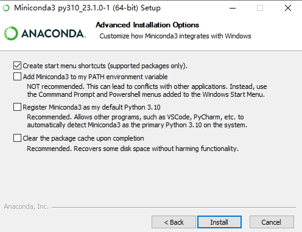
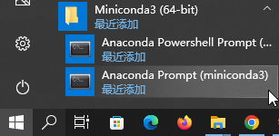

# 安装Conda

- `Miniconda` -- 简洁版（命令行+最小环境）
- `Anaconda` -- 增强版（图形化+很多其它环境包资源，体积大）

### Miniconda方式安装Conda

下载 https://docs.conda.io/en/latest/miniconda.html

> eg: https://repo.anaconda.com/miniconda/Miniconda3-py310_23.1.0-1-Windows-x86_64.exe

双击`.exe`文件进行安装 (选择安装位置)

安装完成后，从`开始`菜单中打开

