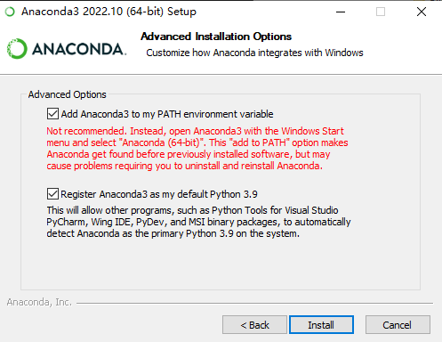
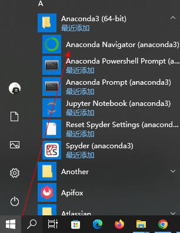

# 安装Conda

- `Miniconda` -- 基础功能版
- `Anaconda` -- 增强版

### Anaconda方式安装Conda

> 可参考 https://docs.conda.io/projects/conda/en/stable/user-guide/install/windows.html

官网下载 https://www.anaconda.com/products/distribution

> ex: https://repo.anaconda.com/archive/Anaconda3-2022.10-Windows-x86_64.exe

双击`.exe`文件进行安装 (选择安装位置和加入PATH环境变量)



安装完成后，从`开始`菜单中打开`Anaconda`


验证安装

```shell
conda --version
```


