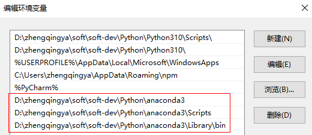
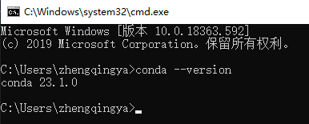

# Conda - 配置环境变量

> `此电脑` -> `属性` -> `高级系统设置` -> `环境变量` -> `系统变量`/`用户变量`

> tips: 如果是`Miniconda`安装方式，配置`miniconda3`路径

```
# 之前安装python的时候默认环境变量用的用户变量，这里也在用户变量中操作吧
# 编辑Path环境变量，新增
D:\zhengqingya\soft\soft-dev\Python\anaconda3
D:\zhengqingya\soft\soft-dev\Python\anaconda3\Scripts
D:\zhengqingya\soft\soft-dev\Python\anaconda3\Library\bin 


# 验证
conda --version
```





