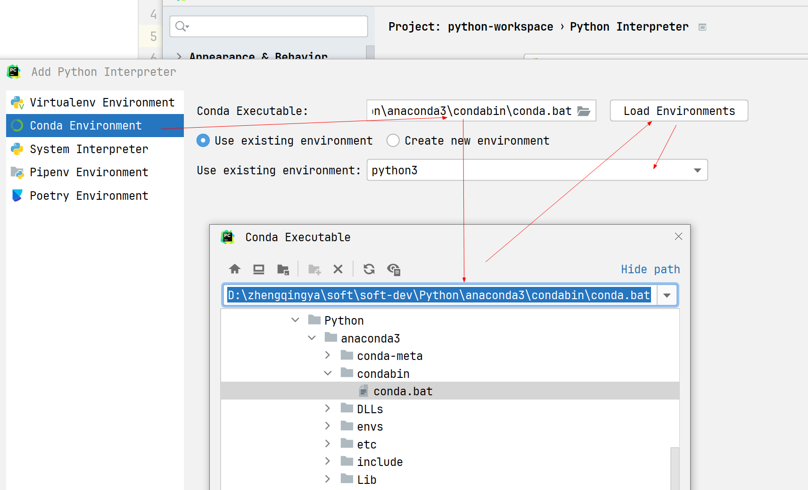
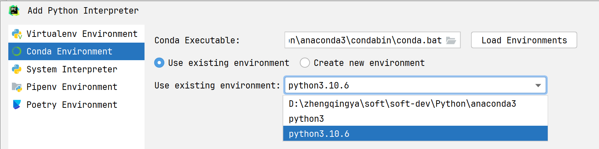
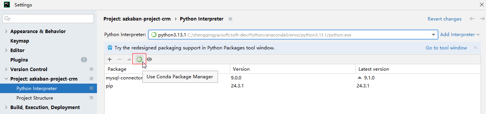

# Pycharm中使用Conda环境




---

> 用上面的方式即可，下面的不用看了...

### 配置


或


可以选择conda创建的虚拟环境
eg: `D:\zhengqingya\soft\soft-dev\Python\anaconda3\envs\my_csdn_exe\python.exe`


选择conda环境后，如果没有自动刷新包依赖，可以手动刷新下


### 测试

```
import sys

print(sys.version)
```


