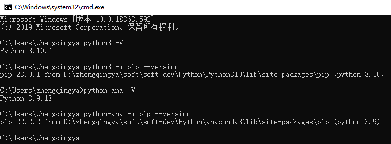
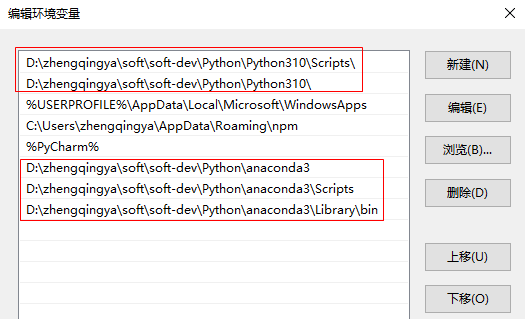
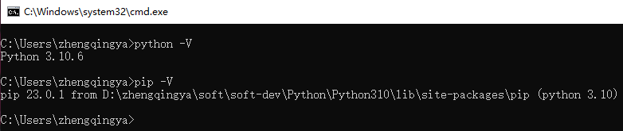

# Python与Anaconda环境变量冲突

同时安装Python和Anaconda & 配置环境变量后，再使用python会发现版本是anaconda的，并非原本的python

```shell
python -m pip --version
# pip 22.2.2 from D:\zhengqingya\soft\soft-dev\Python\anaconda3\lib\site-packages\pip (python 3.9)
```

### 解决

在安装python的根目录下，复制`python.exe` -> `python3.exe`

eg: `D:\zhengqingya\soft\soft-dev\Python\Python310\python3.exe`

在安装anaconda的根目录下，复制`python.exe` -> `python-ana.exe`

eg: `D:\zhengqingya\soft\soft-dev\Python\anaconda3\python-ana.exe`

### 验证

```shell
# python
python3 -V
python3 -m pip --version
# anaconda
python-ana -V
python-ana -m pip --version
```



---

如果默认的python和pip想要用本地的python环境而非anaconda中的，可将python的环境变量上移到anaconda前面即可。



