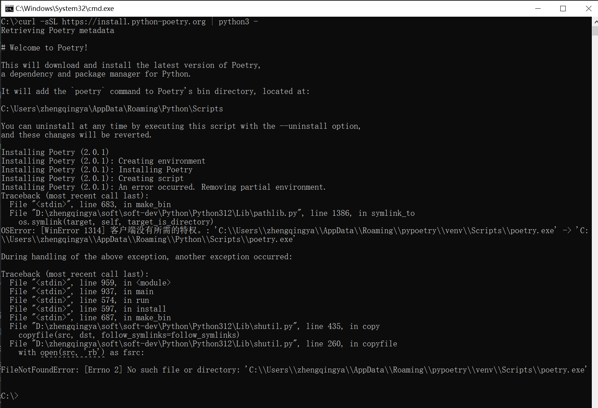
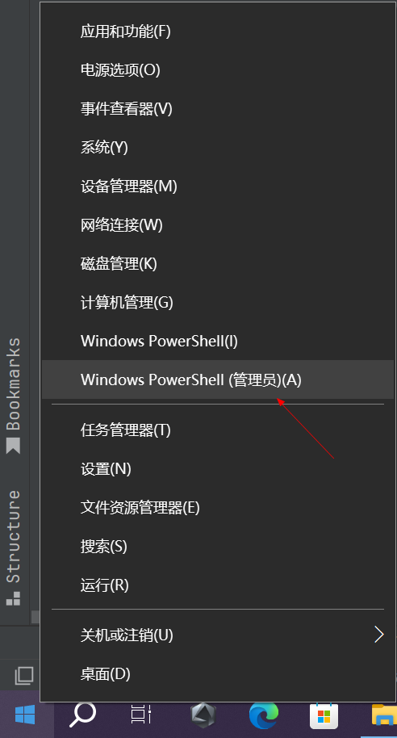
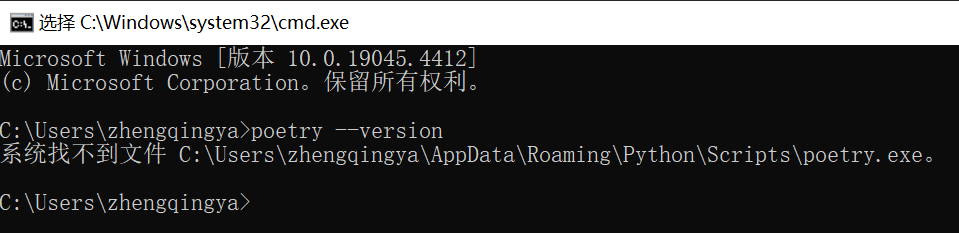
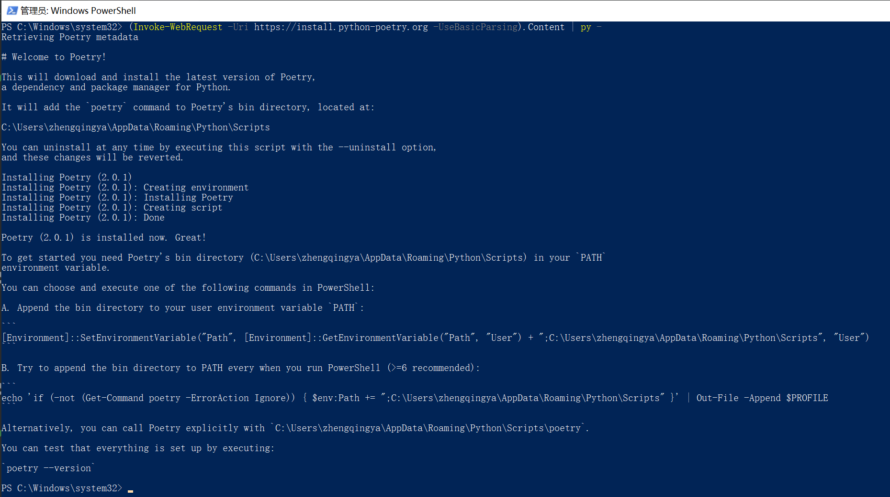
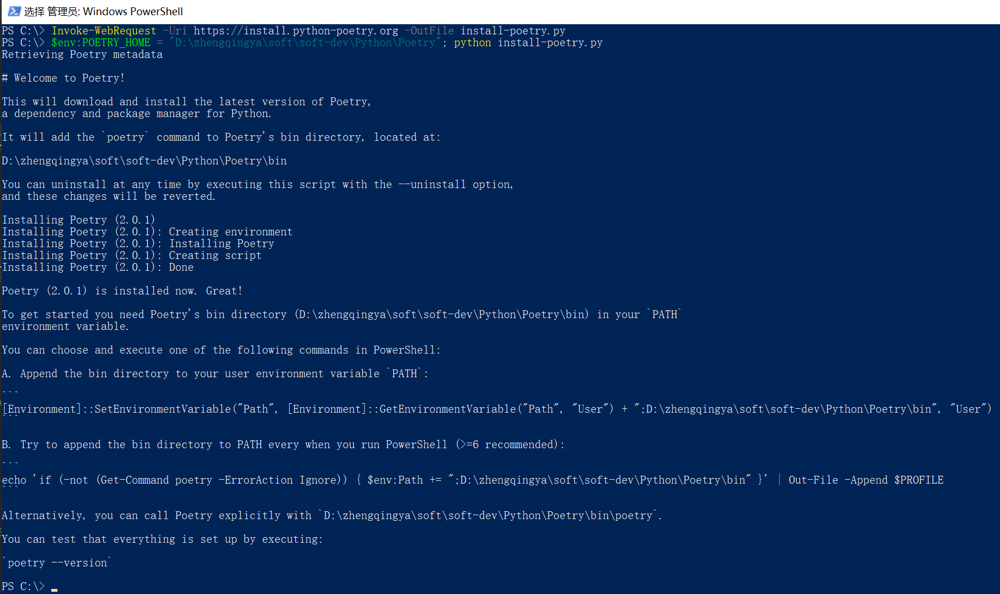
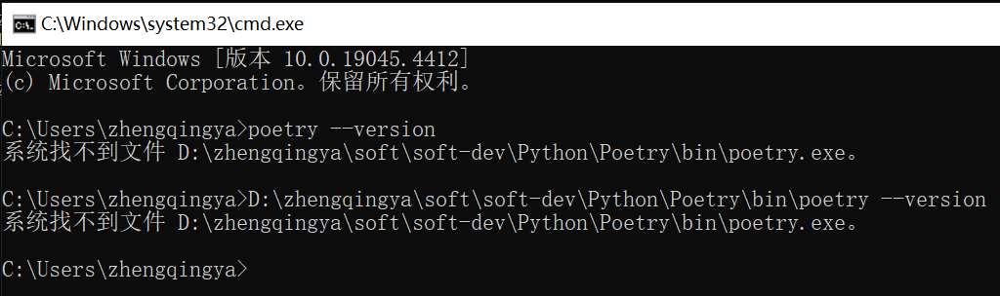

### 一、安装

```shell
curl -sSL https://install.python-poetry.org | python3 -
# 或
pip install poetry
```

#### 问题

如果安装时出现如下错误


```shell
C:\>curl -sSL https://install.python-poetry.org | python3 -
Retrieving Poetry metadata

# Welcome to Poetry!

This will download and install the latest version of Poetry,
a dependency and package manager for Python.

It will add the `poetry` command to Poetry's bin directory, located at:

C:\Users\zhengqingya\AppData\Roaming\Python\Scripts

You can uninstall at any time by executing this script with the --uninstall option,
and these changes will be reverted.

Installing Poetry (2.0.1)
Installing Poetry (2.0.1): Creating environment
Installing Poetry (2.0.1): Installing Poetry
Installing Poetry (2.0.1): Creating script
Installing Poetry (2.0.1): An error occurred. Removing partial environment.
Traceback (most recent call last):
  File "<stdin>", line 683, in make_bin
  File "D:\zhengqingya\soft\soft-dev\Python\Python312\Lib\pathlib.py", line 1386, in symlink_to
    os.symlink(target, self, target_is_directory)
OSError: [WinError 1314] 客户端没有所需的特权。: 'C:\\Users\\zhengqingya\\AppData\\Roaming\\pypoetry\\venv\\Scripts\\poetry.exe' -> 'C:\\Users\\zhengqingya\\AppData\\Roaming\\Python\\Scripts\\poetry.exe'

During handling of the above exception, another exception occurred:

Traceback (most recent call last):
  File "<stdin>", line 959, in <module>
  File "<stdin>", line 937, in main
  File "<stdin>", line 574, in run
  File "<stdin>", line 597, in install
  File "<stdin>", line 687, in make_bin
  File "D:\zhengqingya\soft\soft-dev\Python\Python312\Lib\shutil.py", line 435, in copy
    copyfile(src, dst, follow_symlinks=follow_symlinks)
  File "D:\zhengqingya\soft\soft-dev\Python\Python312\Lib\shutil.py", line 260, in copyfile
    with open(src, 'rb') as fsrc:
         ^^^^^^^^^^^^^^^
FileNotFoundError: [Errno 2] No such file or directory: 'C:\\Users\\zhengqingya\\AppData\\Roaming\\pypoetry\\venv\\Scripts\\poetry.exe'

C:\>
```

解决：以管理员身份运行`Windows PowerShell`


##### 方式1 -- 失败版

> tips: 这种方式经尝试失败，在配置完环境变量后，`poetry`命令无法执行，报错如下：
> 

```
系统找不到文件 C:\Users\zhengqingya\AppData\Roaming\Python\Scripts\poetry.exe。
```

安装

```shell
(Invoke-WebRequest -Uri https://install.python-poetry.org -UseBasicParsing).Content | py -
```

安装成功如图


卸载

```shell
curl -SSL https://install.python-poetry.org | python3 - --uninstall
```

删除安装后的缓存文件 `C:\Users\zhengqingya\AppData\Roaming\pypoetry`

##### 方式2 -- 失败版

```shell
# 下载安装脚本文件 install-poetry.py
Invoke-WebRequest -Uri https://install.python-poetry.org -OutFile install-poetry.py
# 创建安装目录 D:\zhengqingya\soft\soft-dev\Python\Poetry

$env:POETRY_HOME = "D:\zhengqingya\soft\soft-dev\Python\Poetry"; python install-poetry.py
```

安装成功如下


这种方式安装后，显示的执行验证命令也是报错...

```shell
D:\zhengqingya\soft\soft-dev\Python\Poetry\bin\poetry --version
```



##### 方式3

猜测是网络问题，尝试使用代理安装！因为我在公司的电脑上就可以正常安装成功，家里的就不行，最近家里网络刚好又不好...

### 二、环境变量配置

根据安装后的提示：`[Environment]::SetEnvironmentVariable("Path", [Environment]::GetEnvironmentVariable("Path", "User") + ";C:\Users\zhengqingya\AppData\Roaming\Python\Scripts", "User")`
配置环境变量： `此电脑` -> `属性` -> `高级系统设置` -> `环境变量` -> `系统变量`/`用户变量`

```
# 编辑Path环境变量，新增
C:\Users\zhengqingya\AppData\Roaming\Python\Scripts

# 验证
poetry --version
# Poetry (version 2.0.1)
```

### 三、配置镜像加速

```shell
poetry config repositories.aliyun https://mirrors.aliyun.com/pypi/simple/
poetry config repositories.tuna https://pypi.tuna.tsinghua.edu.cn/simple

# 添加私有仓库
# poetry config repositories.private https://private.pypi.org/simple/
# 配置认证信息
# poetry config http-basic.private username password
```

### 常用命令

```shell
# 初始化项目
poetry init
# 添加依赖
poetry add <package>
# 移除依赖
poetry remove <package>
# 安装依赖
poetry install
# 检查依赖冲突
poetry check
# 查看依赖关系树
poetry show --tree
# 构建包
poetry build
# 发布包
poetry publish
# 清理缓存 -- 解决：依赖安装失败
poetry cache clear . --all
# 更新锁文件 -- 解决：锁文件冲突
poetry lock --no-update
```