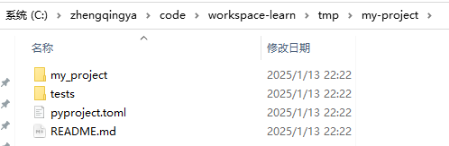

### 创建项目

```shell
# 创建新项目
poetry new my-project
cd my-project
# 初始化
poetry init
```



```
my-project/
├── my_project/          # 包含你的 Python 模块
│   └── __init__.py
├── tests/               # 测试代码存放目录
│   └── test_my_project.py
├── pyproject.toml       # 项目配置和依赖管理文件
└── README.rst           # 项目说明文件
```

### 依赖管理和锁定版本

Poetry 使用 `pyproject.toml` 文件来声明依赖，这比传统的 `requirements.txt` 更加现代化和灵活。
你可以在这个文件中明确指定依赖包及其版本范围。

```toml
[project]
name = "my-project"
version = "0.1.0"
description = ""
authors = [
    {name = "zhengqingya",email = "xxx@qq.com"}
]
readme = "README.md"
requires-python = ">=3.13"
dependencies = [
    "requests (>=2.32.3,<3.0.0)"
]


[build-system]
requires = ["poetry-core>=2.0.0,<3.0.0"]
build-backend = "poetry.core.masonry.api"
```

```shell
# 添加依赖（例如 requests 库）
poetry add requests

# 移除依赖
poetry remove requests

# 安装依赖 -- 安装所有已声明的依赖项，并生成或更新 poetry.lock 文件，确保依赖版本的一致性。
poetry install
```
