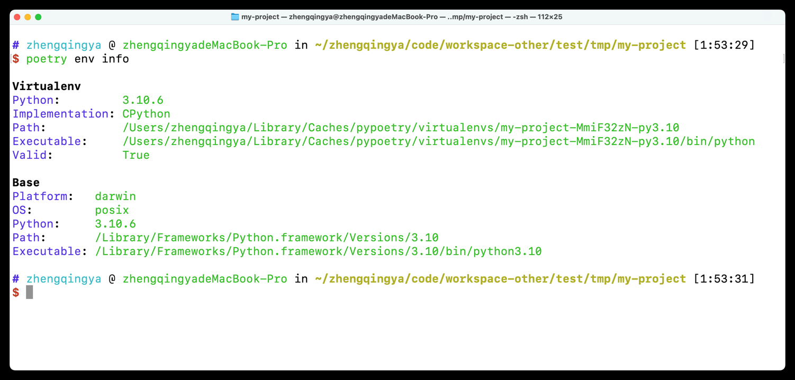

Poetry 自带虚拟环境管理功能，可以为每个项目创建独立的虚拟环境，确保不同项目的依赖不会相互冲突。以下是关于 Poetry 虚拟环境管理的详细说明和常用命令：

参考 [Poetry 官方文档](https://python-poetry.org/docs/managing-environments/)

### 虚拟环境管理

#### 1. 自动创建虚拟环境

当你使用 `poetry install` 或 `poetry add` 等命令时，Poetry 会自动为你的项目创建一个虚拟环境（如果还没有创建）。
默认情况下，虚拟环境会被创建在系统的缓存目录中。

#### 2. 查看当前项目的虚拟环境

```shell
poetry env info
```

输出示例：

```shell
Virtualenv
Python:         3.10.6
Implementation: CPython
Path:           /Users/zhengqingya/Library/Caches/pypoetry/virtualenvs/my-project-MmiF32zN-py3.10
Executable:     /Users/zhengqingya/Library/Caches/pypoetry/virtualenvs/my-project-MmiF32zN-py3.10/bin/python
Valid:          True

Base
Platform:   darwin
OS:         posix
Python:     3.10.6
Path:       /Library/Frameworks/Python.framework/Versions/3.10
Executable: /Library/Frameworks/Python.framework/Versions/3.10/bin/python3.10
```



#### 3. 手动创建虚拟环境

```shell
poetry env use python3.9
```

这将为项目创建一个基于 Python 3.9 的虚拟环境。

#### 4. 列出所有可用的虚拟环境

```shell
poetry env list
```

输出示例：

```
my-project-MmiF32zN-py3.10 (Activated)
other-project-py3.8
```

#### 5. 删除虚拟环境

```shell
poetry env remove python3.9
```

或者指定具体的虚拟环境路径：

```shell
poetry env remove /Users/zhengqingya/Library/Caches/pypoetry/virtualenvs/my-project-MmiF32zN-py3.10
```

#### 6. 激活虚拟环境

Poetry 并没有直接提供激活虚拟环境的命令，但你可以通过以下方式进入虚拟环境：

- 在终端中运行命令时，Poetry 会自动使用项目的虚拟环境。
- 你可以通过 `poetry shell` 命令启动一个新的 shell 会话，在这个会话中，虚拟环境会被激活。

```shell
poetry shell
```

#### 7. 退出虚拟环境

如果你使用了 `poetry shell` 启动了一个新的 shell 会话，可以通过 `exit` 命令退出该会话：

```shell
exit
```

#### 8. 配置虚拟环境位置

如果你希望将虚拟环境存储在项目的根目录下而不是系统的缓存目录中，可以在 `pyproject.toml` 文件中添加以下配置：

```toml
[tool.poetry.config]
virtualenvs.in-project = true
```

这样，虚拟环境将会被创建在项目的 `.venv` 目录中。

### 示例：管理虚拟环境

```shell
# 查看当前项目的虚拟环境信息
poetry env info

# 列出所有可用的虚拟环境
poetry env list

# 创建并使用 Python 3.9 的虚拟环境
poetry env use python3.9

# 激活虚拟环境
poetry shell

# 退出虚拟环境
exit

# 删除虚拟环境
poetry env remove python3.9
```

