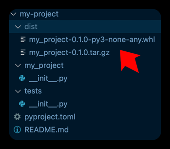

# 发布项目到PyPI

发布 Python 项目到 PyPI（Python Package Index）是将你的库或工具分享给全球开发者的重要步骤。使用 Poetry 可以简化这个过程。以下是详细的步骤，帮助你将项目发布到 PyPI。

- [PyPI 文档](https://packaging.python.org/tutorials/packaging-projects/)
- [Poetry 官方文档](https://python-poetry.org/docs/publishing/) 

### 准备工作

#### 1. 确保项目配置正确

确保 `pyproject.toml` 文件中包含所有必要的元数据。以下是一个示例：

```toml
[tool.poetry]
name = "my-package"
version = "0.1.0"
description = "A short description of your package."
authors = ["Your Name <you@example.com>"]
license = "MIT"

[tool.poetry.dependencies]
python = "^3.9"

[build-system]
requires = ["poetry-core>=1.0.0"]
build-backend = "poetry.core.masonry.api"
```

#### 2. 创建并激活虚拟环境

如果还没有创建虚拟环境，可以使用以下命令创建并激活它：

```shell
poetry env use python3.9
poetry shell
```

#### 3. 安装构建工具

安装用于打包和上传的工具：

```shell
poetry add --dev build twine
```

#### 4. 生成分发文件

使用 `poetry build` 命令生成 `.tar.gz` 和 `.whl` 分发文件：

```shell
poetry build
# Building my-project (0.1.0)
#   - Build# ing sdist
#   - Built my_project-0.1.0.tar.gz
#   - Building wheel
#   - Built my_project-0.1.0-py3-none-any.whl
```

这将在 `dist/` 目录下生成分发文件。


### 发布到 PyPI

#### 1. 注册 PyPI 账号

如果你还没有 PyPI 账号，请先在 [PyPI](https://pypi.org/) 上注册一个账号。

#### 2. 配置 PyPI API Token

推荐使用 PyPI 的 API Token 进行身份验证。你可以通过以下步骤获取并配置 API Token：

- 登录 [PyPI](https://pypi.org/)
- 进入账户设置页面，找到 API Tokens 部分，创建一个新的 API Token。
- 将生成的 API Token 添加到 Poetry 的配置中：

```shell
poetry config pypi-token.pypi YOUR_API_TOKEN
```

#### 3. 上传分发文件

使用 `twine` 工具上传分发文件到 PyPI：

```shell
twine upload dist/*
```

如果你已经配置了 API Token，`twine` 会自动使用该 Token 进行身份验证。

### 示例：完整发布流程

```shell
# 确保项目配置正确
# 编辑 pyproject.toml 文件

# 创建并激活虚拟环境
poetry env use python3.9
poetry shell

# 安装构建工具
poetry add --dev build twine

# 生成分发文件
poetry build

# 配置 PyPI API Token
poetry config pypi-token.pypi YOUR_API_TOKEN

# 上传分发文件到 PyPI
twine upload dist/*
```

### 验证发布

发布完成后，可以在 [PyPI](https://pypi.org/project/my-package/) 上查看你的包是否已成功发布。
你可以尝试安装并测试你的包：

```shell
pip install my-package
```
