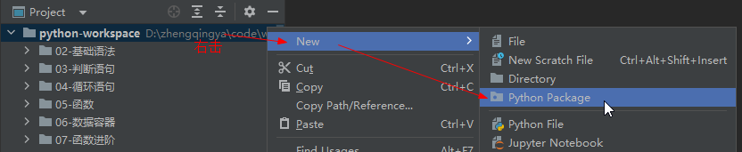

### 自定义包

#### 创建包

`New` -> `Python Package`



创建包会自动生成`__init__.py`文件：标识这是一个python的包，非普通文件夹

#### 创建模块

`my_module1.py`

```
def test():
    print("test1 ...")
```

`my_module2.py`

```
def test():
    print("test2 ...")
```

#### 导入自定义包中的模块并使用

##### 方式一

```
import my_package.my_module1
import my_package.my_module2

my_package.my_module1.test()
my_package.my_module2.test()
```

##### 方式二

```
from my_package import my_module1
from my_package import my_module2

my_module1.test()
my_module2.test()
```

##### 方式三

```
from my_package.my_module1 import test
from my_package.my_module2 import test

test()
test()  # 使用的`my_package.my_module2`下的test
```

#### `__init__.py` -> `__all__` 控制`import *`可使用模块


`__init__.py`

```
__all__ = ["my_module1"]
```

导入自定义包中的模块并使用时发现`my_module2`无法调用，因为在`__init__.py`中未声明引用

```
from my_package import *

my_module1.test()
# my_module2.test() # 无法调用
```