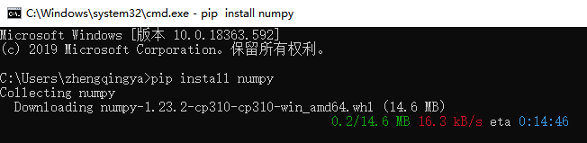

### 第三方包

第三方包：非Python官方内置的包，可以通过安装它们扩展功能，提高开发效率。

ex:

1. 科学计算中常用的：`numpy`包
2. 数据分析中常用的：`pandas`包
3. 大数据计算中常用的：`pyspark`、`apache-flink`包
4. 图形可视化常用的：`matplotlib`、`pyecharts`
5. 人工智能常用的：`tensorflow`

> 由于是第三方的包，Python没有内置，所以我们需要安装它们才可以导入使用

### 安装第三方包

#### 方式一：pip

> 使用Python内置的pip程序安装即可

```shell
pip install 包名称
```

##### pip网络优化

问题：pip是连接的国外网站进行包的下载，有时候速度会很慢


解决：通过`-i`使用清华源进行下载

```shell
pip install -i https://pypi.tuna.tsinghua.edu.cn/simple 包名称
```


#### 方式二：PyCharm

`File` -> `Settings...` -> `Python Interpreter`

