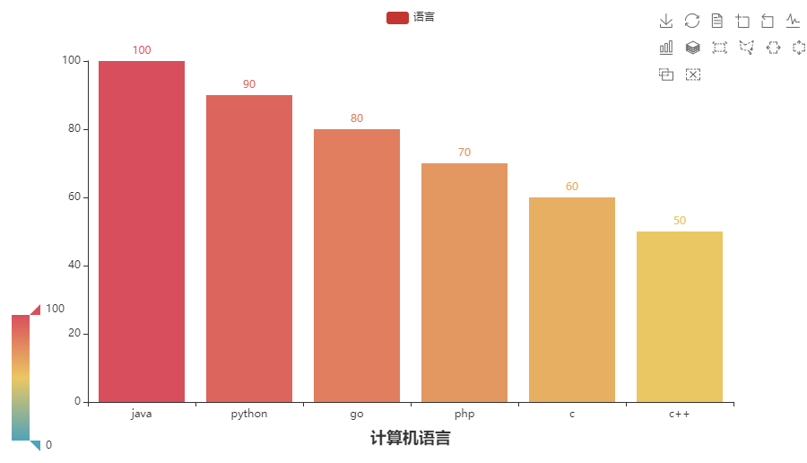

# Pyecharts

数据可视化

> - https://github.com/pyecharts/pyecharts
> - https://pyecharts.org/#/zh-cn/intro

### 安装

```shell
pip install pyecharts
```


### 使用

```
# 导包
from pyecharts.charts import Bar
from pyecharts.options import TitleOpts, LegendOpts, ToolboxOpts, VisualMapOpts

# bar对象
bar = Bar()
# x轴
bar.add_xaxis(["java", "python", "go", "php", "c", "c++"])
# y轴
bar.add_yaxis("语言", [100, 90, 80, 70, 60, 50])

# 全局配置项 set_global_opts  详细配置见 https://pyecharts.org/#/zh-cn/global_options
bar.set_global_opts(
    # 标题配置项
    title_opts=TitleOpts(title="计算机语言", pos_left="center", pos_bottom="1%"),
    # 图例配置项
    legend_opts=LegendOpts(is_show=True),
    # 工具箱配置项
    toolbox_opts=ToolboxOpts(is_show=True),
    # 视觉映射配置项
    visualmap_opts=VisualMapOpts(is_show=True),
)

# render 会生成本地 HTML 文件，默认会在当前目录生成 render.html 文件
# 也可以传入路径参数，如 bar.render("mycharts.html")
bar.render()
```


