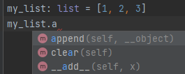
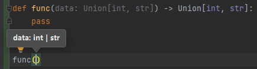

### 类型注解

> python3.5版本之后引入

类型注解：对数据类型进行显式的说明、提示。 ex：PyCharm的代码提示

> tips: 仅做提示使用，就算数据类型和类型注解无法对应也不会导致代码的错误。



#### 类型注解 - 变量

- 语法1：`变量: 类型`
- 语法2：在注释中，`# type: 类型`

```
# 基础数据类型注解
var_1: int = 666
var_2: str = "字符串"
var_3: float = 6.6
var_4: bool = True


# 类对象类型注解
class User:
    pass


user: User = User()


# 基础容器类型注解
my_str: str = "zhengqingya"
my_list: list = [1, 2, 3]
my_set: set = {1, 2, 3}
my_dict: dict = {"age": 18}
my_tuple: tuple = ("zq", 18, True)


# 容器类型详细注解
my_list: list[int] = [1, 2, 3]
my_set: set[int] = {1, 2, 3}
my_dict: dict[str, int] = {"age": 18}
my_tuple: tuple[str, int, bool] = ("zq", 18, True)


# 在注释中进行类型注解
my_str = "zq"  # type: str
```

#### 类型注解 - 函数(方法)形参和返回值

语法：

```
# 形参类型注解
def 函数(方法)名(形参名1: 类型, 形参名2: 类型, ...):
    pass
    
# 返回值类型注解
def 函数(方法)名(形参名1: 类型, 形参名2: 类型, ...) -> 返回值类型:
    pass
```

示例：

```
def add(x: int, y: int) -> int:
    pass
```

#### 使用`Union类型`进行联合类型注解



```
# 导包
from typing import Union

# 定义联合类型注解
Union[类型1, 类型2, ...]
```

示例：

```
def func(data: Union[int, str]) -> Union[int, str]:
    pass
```