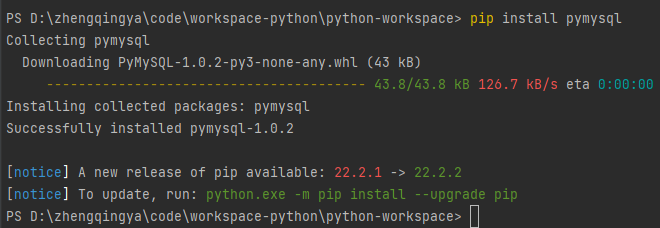

# pymysql

pymysql：可以对MySQL数据库进行操作的第三方库。

### 安装

```shell
pip install pymysql
```



### 使用

```
from pymysql import Connection

# 获取mysql的链接对象
conn = Connection(
    host="localhost",  # 主机名或IP地址
    port=3306,  # 端口
    user="root",  # 账号
    password="root",  # 密码
    autocommit=True,  # 自动提交 -- 更新数据的时候无需手动提交commit
)

# 获取版本信息
print(conn.get_server_info())

# 拿到游标对象
cursor = conn.cursor()
conn.select_db("demo")

# 使用游标对象，执行sql语句
cursor.execute(
    "CREATE TABLE IF NOT EXISTS `t_test` ( `id` int(11) NOT NULL AUTO_INCREMENT, `name` varchar(50) DEFAULT NULL, PRIMARY KEY (`id`) ) ENGINE=InnoDB AUTO_INCREMENT=1 DEFAULT CHARSET=utf8mb4;"
)

# 插入数据
cursor.execute("insert into t_test(name) values ('小郑');")
cursor.execute("insert into t_test(name) values ('小张');")
# 手动提交数据
# conn.commit()

# 查询数据
cursor.execute("select * from t_test")
results: tuple = cursor.fetchall()
for item in results:
    print(item)

# 关闭链接
conn.close()
```