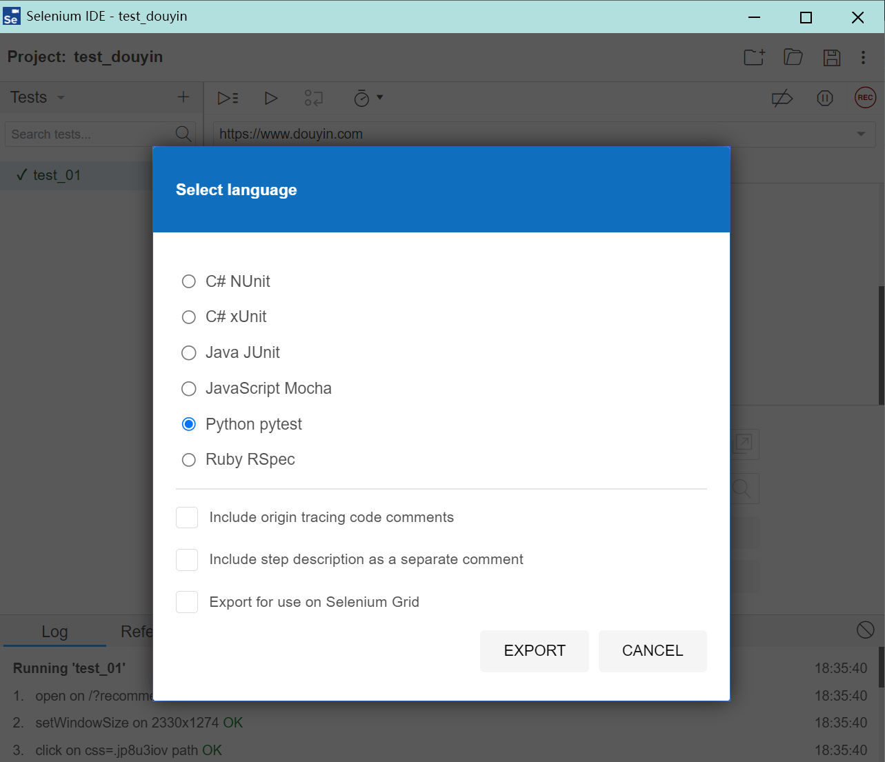

# Selenium IDE

Selenium IDE 是一个基于浏览器的插件/扩展，允许用户录制在浏览器中的操作，并自动生成 Selenium 脚本。
这些脚本可以用于自动化测试，也可以轻松转化为爬虫脚本。
随着技术的演进，Selenium IDE 已经成为一个独立的桌面应用程序，支持多种浏览器，并且功能更加丰富。

- https://github.com/SeleniumHQ/selenium-ide
- https://www.selenium.dev/selenium-ide/
- [谷歌浏览器插件](https://chromewebstore.google.com/detail/selenium-ide/mooikfkahbdckldjjndioackbalphokd)

录制好之后可以导出java或python脚本代码。

