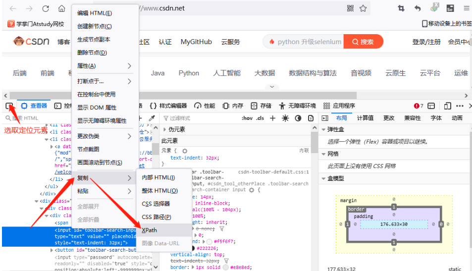

# Selenium基础入门

### 一、Selenium简介

Selenium 是一个用于 Web 应用程序测试的工具。最初是为网站自动化测试而开发的，可以直接运行在浏览器上，支持的浏览器包括 IE（7, 8, 9, 10, 11），Mozilla Firefox，Safari，Google Chrome，Opera 和 Edge 等。

爬虫中使用它是为了`解决 requests 无法直接执行 JavaScript 代码的问题`。`Selenium 本质上是通过驱动浏览器，彻底模拟浏览器的操作`，好比跳转、输入、点击、下拉等，来拿到网页渲染之后的结果。
Selenium 是 Python 的一个第三方库，对外提供的接口能够操作浏览器，从而让浏览器完成自动化的操作。

特点：`Selenium 能模拟浏览器功能自动执行网页中的 JavaScript 代码，实现动态加载`。

### 二、Selenium的安装

1、下载浏览器驱动

谷歌浏览器驱动下载地址：[https://registry.npmmirror.com/binary.html?path=chromedriver/](https://registry.npmmirror.com/binary.html?path=chromedriver/) 查看自己谷歌浏览器的版本，如果你的浏览器版本高于驱动下载地址中最新版本，去官网的测试页面下载对应版本的驱动（[https://googlechromelabs.github.io/chrome-for-testing/#stable](https://googlechromelabs.github.io/chrome-for-testing/#stable)）。

2、 环境配置

把chromedriver.exe文件放到 PyCharm 项目的根目录下

3、安装 selenium 库，`pip install selenium`

### 三、Selenium的使用

#### 1.访问web网站

```
from selenium import webdriver  
  
# 创建浏览器操作对象  
path = 'chromedriver.exe'  
browser = webdriver.Chrome(path)  
  
# 访问网站  
url = 'https://www.baidu.com'  
  
browser.get(url)
```

需要注意的是，如果你的 selenium 是`4.11.2`以上的版本，则不需要设置`driver.exe`的路径，selenium 可以自己处各种浏览器的驱动程序，因此代码直接改为`brower = webdriver.Chrome()`即可。

运行代码，得到下面的效果：


#### 2.元素定位

自动化工具要做的就是模拟鼠标和键盘来操作点击、输入等等元素，但是操作这些元素的前提是找到它们，WebDriver 提供了很多元素定位的方法：

*   `find_element()`系列：用于定位单个的页面元素。
*   `find_elements()`系列：用于定位一组页面元素，获取到的是一组列表。

##### 根据标签 id 获取元素

```
from selenium import webdriver  
from selenium.webdriver.common.by import By  
  
# 创建浏览器操作对象  
path = 'chromedriver.exe'  
browser = webdriver.Chrome(path)  
  
# 访问网站  
url = 'https://www.baidu.com'  
browser.get(url)  
  
# 根据标签 id 获取元素  
button = browser.find_element(By.ID, 'su')  
print(button)
```

##### 根据标签 name 属性的值获取元素

```
button = browser.find_element(By.NAME, 'wd')
print(button)
```

##### 根据 Xpath 语句获取元素

```
button = browser.find_element(By.XPATH, '//input[@id="su"]')
print(button)
```

`xpath`是一种在XML文档中定位元素的语言

*   使用绝对路径定位

指的是从网页的HTML代码结构的最外层一层层的写到需要被定位的页面元素为止。`绝对路径起始于/，每一层都被/所分割`。如：`/html/body/div[2]/form/input[3]`

示例说明：  
(1)可以用中括号选择分支，`div[2]`代表的是当前层级下的第二个div标签；  
(2)一般情况下较少使用绝对路径的方式做定位，原因在于绝对路径的表达式一般太长，不便于后期的代码维护，代码的微小改变就可能导致这个路径失效，从而无法完成元素定位。

*   使用相对路径定位

不是从根目录写起，而是从网页文本的任意目录开始写。`相对路径起始于//，//所表示的含义是“任意标签下”`。如：`//input[@id='kw']`

示例说明:  
(1)在当前页面查找任意目录下的input元素，且该元素的id属性取值为kw  
(2)在xpath里，属性以@开头  
(3)所选取的属性可以是任意属性，只要其有利于标识这个元素即可  
(4)推荐使用相对路径结合属性的这种xpath表达式，它往往更简洁更易于维护  
(5)有时候可能会出现一个属性不足以标识某个元素，可以使用逻辑运算符and来连接多个属性进行标识。`//input[@xx='aa' and @yy='bb']`  
(6)有时候一个元素它本身没有可以唯一标识它的属性，这时我们可以找它的上层或者上上层， 然后再往写。`//input[@xx='aa']/p`

| 表达式 | 描述 |
| --- | --- |
| `nodename` | 选取此节点的所有子节点 |
| `/` | 从当前节点选取直接子节点 |
| `//` | 从当前节点选取子孙节点 |
| `.` | 选取当前节点 |
| `..` | 选取当前节点的父节点 |
| `@` | 选取属性 |
| `*` | 选取属性 |



点击后会存在与剪切板中，`Ctrl+v`粘贴到代码中即可使用,这里获取到的是相对路径。

##### 根据标签名获取元素

```
button = browser.find_element(By.TAG_NAME, 'input')
print(button)
```

##### 根据CSS选择器获取元素

```
button = browser.find_element(By.CSS_SELECTOR, '#su')
print(button)
```

*   find_element(By.CSS_SELECTOR,‘XX’)根据元素的css选择器来完成定位，可以准确定位任何元素，但需要熟练掌握css选择器

*   css选择器

    *   类选择器--------`.XXX`选择class属性为xxx的元素
    *   id选择器-------- `#XXX`选择id属性为xxx的元素
    *   元素选择器-----`XXX`选择标签名为xxx的元素
    *   属性选择器-----`[yyy='bbb']`选择yyy属性取值为bbb的元素
    *   派生选择器-----`AA>XX或AA XX`选择AA标签下的XX元素
*   你可以通过获取xpath的方式来从页面获取css选择器


在css里标识层级关系使用的是`>`或者`空格`（xpath里使用的是`/`）`div#xx1>input.yy2`

> 对于css的属性值来说，可以加引号也可以不加，注意属性的引号和整个CSS表达式的引号要进行区分。对于xpath的属性值来讲，需要加上引号，否则报错。

##### 根据标签的文本获取元素（精确定位）

```
button = browser.find_element(By.LINK_TEXT, '地图')
print(button)
```

##### 根据标签的文本获取元素（模糊定位）

```
button = browser.find_element(By.PARTIAL_LINK_TEXT, '地')
print(button)
```

##### 根据 class 属性获取元素

```
button = browser.find_element(By.CLASS_NAME, 'wrapper_new')
print(button)
```

当我们定位到元素之后，自然就要考虑如何获取到元素的各种信息，selenium 给我们提供了获取元素不同信息的方法

#### 3.获取元素信息

```
button = browser.find_element(By.ID, 'su')  
# 获取元素属性  
print(button.get_attribute('class'))  
# 获取元素标签名  
print(button.tag_name)  
# 获取元素文本  
print(button.text)  
# 获取元素位置  
print(button.location)  
# 获取元素大小  
print(button.size)
```

#### 4.Selenium的交互

页面交互指的是我们平时在浏览器上的各种操作，比如输入文本、点击链接、回车、下拉框等，下面就演示 selenium 是如何进行页面交互的。

##### 输入文本

```
import time  
from selenium import webdriver  
from selenium.webdriver.common.by import By  
  
# 创建浏览器操作对象  
path = 'chromedriver.exe'  
browser = webdriver.Chrome(path)  
  
# 访问网站  
url = 'https://www.baidu.com'  
browser.get(url)  
  
# 定位输入框  
input = browser.find_element(By.ID, 'kw')  
# 输入文本selenium  
input.send_keys('selenium')  
time.sleep(2)  
  
# 关闭浏览器  
browser.close()
```

##### 清除文本

```
# 定位输入框
input = browser.find_element(By.ID, 'kw')
# 输入文本selenium
input.send_keys('selenium')
time.sleep(2)

# 清除文本
input.clear()
time.sleep(2)
```

##### 点击

```
import time  
from selenium import webdriver  
from selenium.webdriver.common.by import By  
  
# 创建浏览器操作对象  
path = 'chromedriver.exe'  
browser = webdriver.Chrome(path)  
  
# 访问网站  
url = 'https://www.baidu.com'  
browser.get(url)  
  
# 定位输入框  
input = browser.find_element(By.ID, 'kw')  
# 输入文本selenium  
input.send_keys('selenium')  
time.sleep(2)  
  
# 定位百度一下的按钮  
button = browser.find_element(By.ID, 'su')  
# 点击按钮  
button.click()  
time.sleep(2)  
  
# 关闭浏览器  
browser.close()
```

##### 回车确认

```
# 定位输入框
input = browser.find_element(By.ID, 'kw')
# 输入文本selenium
input.send_keys('selenium')
time.sleep(2)

# 回车查询 
input.submit() 
time.sleep(2)
```

> *   `submit()`只能用于包含属性`type='submit'`的标签，并且嵌套在`form`表单中。
> *   也可以使用`click()`代替`submit()`使用。

##### 运行 JavaScript

```
# 定位输入框
input = browser.find_element(By.ID, 'kw')
# 输入文本selenium
input.send_keys('selenium')
time.sleep(2)

# 回车查询 
input.submit() 
time.sleep(2)

# 执行js代码 
js_bottom = 'document.documentElement.scrollTop=100000' 
# 下拉进度条，页面滑动 
browser.execute_script(js_bottom) 
time.sleep(2)
```

##### 前进后退

```
import time  
from selenium import webdriver  
from selenium.webdriver.common.by import By  
  
# 创建浏览器操作对象  
path = 'chromedriver.exe'  
browser = webdriver.Chrome(path)  
  
# 访问网站  
url = 'https://www.baidu.com'  
browser.get(url)  
  
# 定位输入框  
input = browser.find_element(By.ID, 'kw')  
# 输入文本selenium  
input.send_keys('selenium')  
time.sleep(2)  
  
# 回车查询  
input.submit()  
time.sleep(2)  
  
# 执行js代码  
js_bottom = 'document.documentElement.scrollTop=100000'  
# 下拉进度条，页面滑动  
browser.execute_script(js_bottom)  
time.sleep(2)  
  
# 定位下一页的按钮，并点击  
next = browser.find_element(By.XPATH, '//a[@class="n"]')  
next.click()  
time.sleep(2)  
  
# 返回到上一页面  
browser.back()  
time.sleep(2)  
  
# 前进到下一页  
browser.forward()  
time.sleep(2)  
  
# 关闭浏览器  
browser.close()
```

##### 调整浏览器窗口尺寸

*   `maximize_window()`窗口最大化。
*   `minimize_window()`窗口最小化。
*   `set_window_size(width,height)`调整窗口到指定尺寸。

```
# 窗口最大化 
browser.maximize_window()
time.sleep(2) 
# 窗口最小化 
browser.minimize_window() 
time.sleep(2) 
# 指定窗口尺寸 
browser.set_window_size(300, 500)
```

##### 页面刷新

```
# 页面刷新
browser.refresh()
```

##### 窗口切换

*   `current_window_handle`获取当前窗口的句柄
*   `window_handles`获取所有打开页面的句柄，是一个列表
*   `switch_to.window(“XX”)`切换到指定页面，XX代表页面句柄
*   `switch_to.frame(XX)`切换到内敛框架页面，XX代表内联框架标签的定位对象。
*   `swith_to.parent_frame()`切回到内敛框架的上一级，即从内敛框架切出。
*   `switch_to.alert`切换到页面弹窗。

##### 下拉列表操作

*   `Select("XX)`判断标签元素XX是否为下拉列表元素，是返回Select对象，不是报错
*   `select_by_value("XX")`通过下拉列表value属性的值XX选择选项
*   `select_by_visible_text("XX")`通过下拉列表文本内容XX选择选项
*   `select_by_index(N)或options[N].click()`通过下拉列表索引号N选则选项，从0 开始

##### 弹窗操作

*   `switch_to.alert`获取弹窗对象。
*   `text`弹窗内容
*   `accept()`接受弹窗
*   `dismiss()`取消弹窗

##### 三种等待方法

*   `sleep(n)`强制等待，需要导入time包，n表示等待秒数；用于避免因元素未加载出来而定位失败的情况。
*   `implicitly_wait(n)`隐式等待，如果超过n秒，抛出找不到元素的异常；隐式等待只需要声明一次，一般在打开浏览器后进行声明。隐式等待存在的问题是程序会一直等待整个页面加载完成才会执行下一步，有时候想要定位的元素早就加载好了，但是由于别的页面元素没加载好，仍会等到整个页面加载完成才能执行下一步。
*   `WebDriverWait(browser,n,h)`：显式等待,browser代表浏览器对象，n等待时长，h频率。相比于隐式等待，显式等待只针对指定的元素生效，不再是针对所有的页面元素。可以根据需要定位的元素来设置显式等待，无需等待页面完全加载，节省了大量因加载无关紧要的页面元素而浪费的时间。使用方法：`WebDriverWait(browser,5,0.5).until(expected_conditions.presence_of_element_located((By.ID,'kw')))`

### 四、Chrome handless

在上面的测试过程中可以发现，虽然 selenium 简便好用，但是它的`运行速度很慢，这是因为 selenium 是有界面的，需要执行前端 css 和 js 的渲染`。那么下面就介绍一个无界面的浏览器，Chrome-handless 模式，运行效率要比真实的浏览器快很多，在 selenium 的基础上，支持页面元素查找、js 执行等，代码和 selenium 一致。

使用前提：

*   Chrome
    *   Unix\Linux chrome >= 59
    *   Windows chrome >= 60
*   Python >= 3.6
*   Selenium >= 3.4.*
*   ChromeDriver >= 2.31

#### ChromeOptions常用配置

```
# 配置对象
options = webdriver.ChromeOptions()
options.add_experimental_option("excludeSwitches", ["enable-automation"])  # 禁止浏览器被监控提示
options.add_experimental_option('detach', True) # 不自动关闭浏览器
options.add_argument('--headless') # 设置无窗口模式
options.add_argument('--disable-gpu') # 禁用gpu加速
options.add_argument("--user-agent='  '")  # 设置请求头user-agent
options.add_argument('--start-maximized')  # 设置窗口最大化
options.add_argument('--window-size=200,200')  # 设置窗口大小
options.add_argument('--incognito')  # 无痕模式
options.add_argument('--hide-scrollbars')  # 隐藏滚动条
options.add_argument('--disable-javascript')  # 禁用js
options.add_argument('--blink-settings=imagesEnabled=false')  # 不加载图片（拦截图片）
```

#### Chrome handless使用

```
from selenium import webdriver  
from selenium.webdriver.chrome.service import Service  
from selenium.webdriver.chrome.options import Options  
  
  
# 浏览器封装  
def share_browser():  
    win_path = 'chromedriver.exe'  
  
    # 配置对象  
    options = Options()  
    options.add_argument('--headless')  # 设置无窗口模式  
    options.add_argument('--disable-gpu')  # 禁用gpu加速  
  
    # 创建浏览器  
    service = Service(win_path)  
    browser = webdriver.Chrome(service=service, options=options)  
    # 返回  
    return browser  
  
  
# 创建浏览器  
browser = share_browser()  
  
# 打开指定网址  
browser.get('https://www.baidu.com')  
  
# 保存快照  
browser.save_screenshot('baidu.png')  
  
# 退出  
browser.quit()
```
