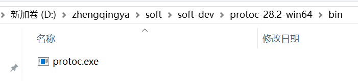
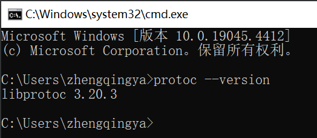

# Protobuf

protobuf是Google公司提出的一种轻便高效的结构化数据存储格式，常用于结构化数据的序列化，具有语言无关、平台无关、可扩展性特性，常用于通讯协议、服务端数据交换场景。

[下载protobuf](https://github.com/protocolbuffers/protobuf/releases)

### Windows 安装

> eg: https://github.com/protocolbuffers/protobuf/releases/download/v28.2/protoc-28.2-win64.zip

解压：


#### 配置环境变量

> `此电脑` -> `属性` -> `高级系统设置` -> `环境变量`

```
# 编辑PATH环境变量，新增
D:\zhengqingya\soft\soft-dev\protoc-28.2-win64\bin
```

```shell
# 查看版本
protoc --version
```



### 测试

定义数据结构

> 官方文档：https://developers.google.com/protocol-buffers/docs/pythontutorial

`test.proto`

```shell
syntax = "proto3";

package zqtest;

message User {
    string name = 1;
    int32 age = 2;
}

message User2 {
    string id = 1;
    string name = 2;
}
```

转换Python版本

```shell
protoc  --python_out=.  test.proto
```

执行命令后会自动生成 `test_pb2.py`

```shell
# -*- coding: utf-8 -*-
# Generated by the protocol buffer compiler.  DO NOT EDIT!
# source: test.proto
"""Generated protocol buffer code."""
from google.protobuf.internal import builder as _builder
from google.protobuf import descriptor as _descriptor
from google.protobuf import descriptor_pool as _descriptor_pool
from google.protobuf import symbol_database as _symbol_database
# @@protoc_insertion_point(imports)

_sym_db = _symbol_database.Default()


DESCRIPTOR = _descriptor_pool.Default().AddSerializedFile(b'\n\ntest.proto\x12\x06zqtest\"!\n\x04User\x12\x0c\n\x04name\x18\x01 \x01(\t\x12\x0b\n\x03\x61ge\x18\x02 \x01(\x05\"!\n\x05User2\x12\n\n\x02id\x18\x01 \x01(\t\x12\x0c\n\x04name\x18\x02 \x01(\tb\x06proto3')

_builder.BuildMessageAndEnumDescriptors(DESCRIPTOR, globals())
_builder.BuildTopDescriptorsAndMessages(DESCRIPTOR, 'test_pb2', globals())
if _descriptor._USE_C_DESCRIPTORS == False:

  DESCRIPTOR._options = None
  _USER._serialized_start=22
  _USER._serialized_end=55
  _USER2._serialized_start=57
  _USER2._serialized_end=90
# @@protoc_insertion_point(module_scope)
```

```shell
pip install protobuf
```

```python
# 1.序列化 -- 创建对象转换成字节，用于网络传输
from test_pb2 import User, User2

u1 = User()
u1.name = "zhengqingya"
u1.age = 18

print(u1.SerializeToString())

u2 = User2()
u2.id = "666"
u2.name = "zq"
u2Str = u2.SerializeToString()

# 2.反序列化 -- 将字节转化为对象
user_obj = User2()
user_obj.ParseFromString(u2Str)
print(f"{user_obj.id} -- {user_obj.name}")

# 3.对象转字典
from google.protobuf import json_format

data_dict = json_format.MessageToDict(user_obj)
print(data_dict, type(data_dict))

data_string = json_format.MessageToJson(user_obj, ensure_ascii=False)
print(data_string, type(data_string))
```
