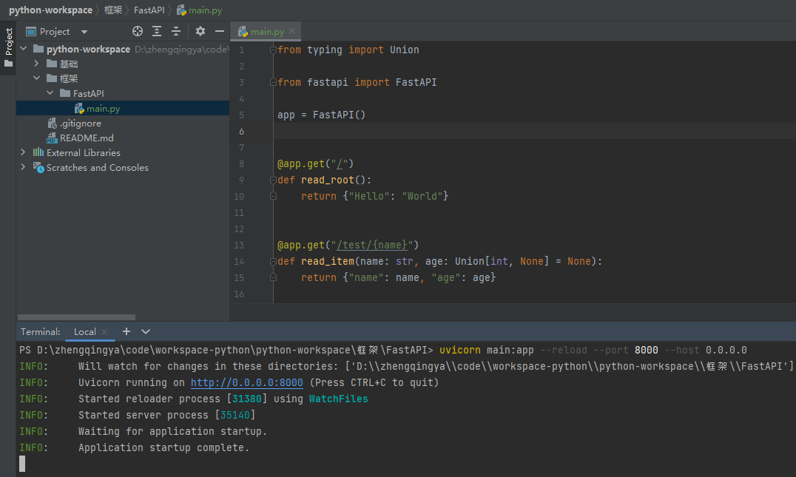
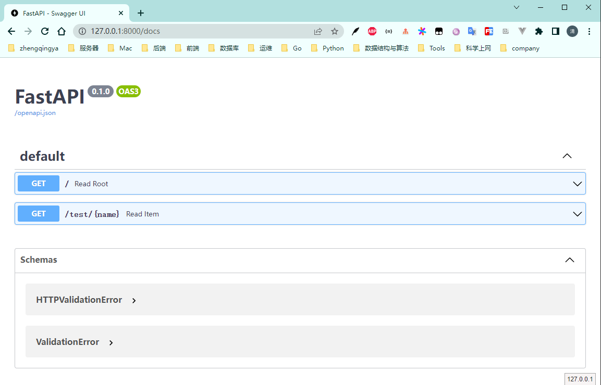

###### `main.py`

```
from typing import Union

from fastapi import FastAPI

app = FastAPI()


@app.get("/")
def read_root():
    return {"Hello": "World"}


@app.get("/test/{name}")
def read_item(name: str, age: Union[int, None] = None):
    return {"name": name, "age": age}
```

###### 运行

```shell
uvicorn main:app --reload --port 8000 --host 0.0.0.0
```



###### 访问

- http://127.0.0.1:8000
- http://127.0.0.1:8000/test/zq?age=18

###### API文档

- http://127.0.0.1:8000/docs
- http://127.0.0.1:8000/redoc


