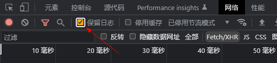

# 爬虫

`robots.txt`：引导搜索引擎蜘蛛抓取指定栏目或内容;

ex: https://www.baidu.com/robots.txt

### 反爬

简单的情况下可通过`User-Agent`解决，简称UA

```
headers = {
    "User-Agent": "Mozilla/5.0 (Windows NT 10.0; Win64; x64) AppleWebKit/537.36 (KHTML, like Gecko) Chrome/109.0.0.0 Safari/537.36"
}
```

### 其它

如果页面登录成功跳转过后看不到之前的请求数据，可以勾上`保留日志`

