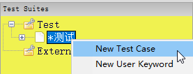
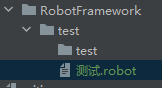

# 使用

新建一个UI自动化项目，打开百度搜索python。

`File` -> `New Project`


在项目上新建一个测试套件 `右击` -> `New Suite`


`左击测试套件` -> `Library` -> 导入`Selenium2Library`类库


套件上新建一个测试用例`New Test Case`



编写用例，运行


---



`测试.robot`

```shell
*** Settings ***
Library           Selenium2Library
*** Test Cases ***
测试打开百度
    Open Browser    https://www.baidu.com    chrome
    Sleep    1s
    Input Text    id=kw    python
    Sleep    1s
    Click Button    id=su
    Sleep    5s
```
