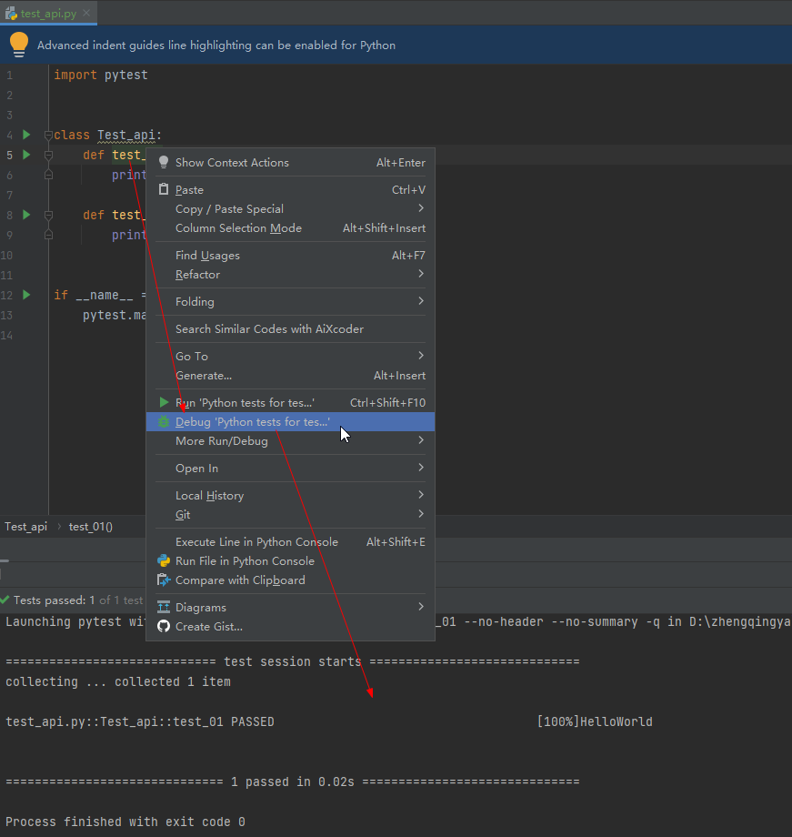
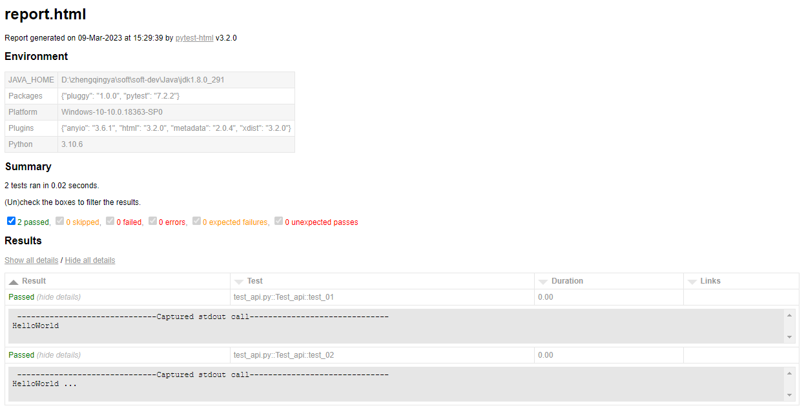

# 第一个测试用例

1. 测试文件以 `test_xx.py` 命名需要以 `test_`开头（或`_test` 结尾）
2. 测试类以 `Test_`开头，并且不能带有 init 方法
3. 测试函数或方法以 `test_xx` 开头

### 一、编写测试用例

`test_api.py`

```
class Test_api:
    def test_01(self):
        print("HelloWorld")

    def test_02(self):
        print("HelloWorld ...")
```

### 二、执行测试用例

#### 1、整体运行

##### 方式1：cmd 窗口

```shell
pytest test_api.py
```

##### 方式2：PyChram

`pytest.main()`

```
import pytest


class Test_api:
    def test_01(self):
        print("HelloWorld")

    def test_02(self):
        print("HelloWorld ...")


if __name__ == "__main__":
    pytest.main()
```

#### 2、执行指定文件指定方法

##### 方式1：cmd 窗口

```shell
pytest 文件路径::类名::方法名例如
# eg:
pytest test_api.py::Test_api::test_01
```

##### 方式2：PyChram

在指定的方法上右击运行即可


#### 3、多线程运行

```shell
# 多线程运行
pip install pytest-xdist
# -vs: 输出详细信息
# -n: 多线程运行
pytest -vs -n=3 test_api.py
```

### 三、生成测试报告

```shell
# 安装pytest-html
pip install pytest-html
# 生成报告
pytest --html=report.html test_api.py
```


