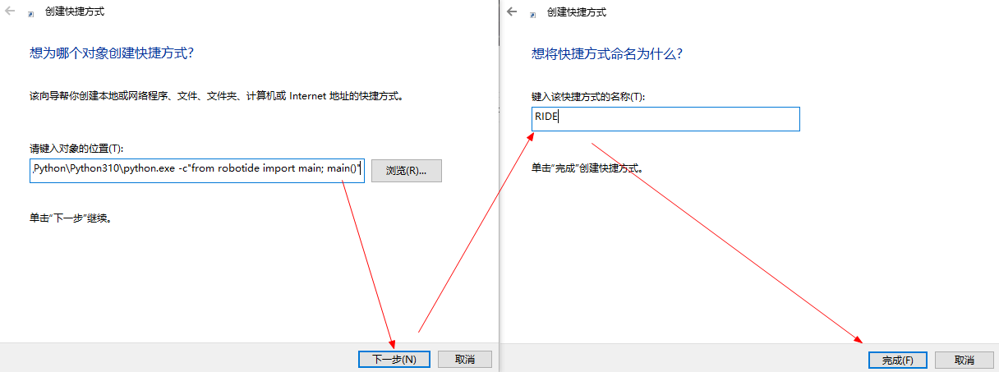
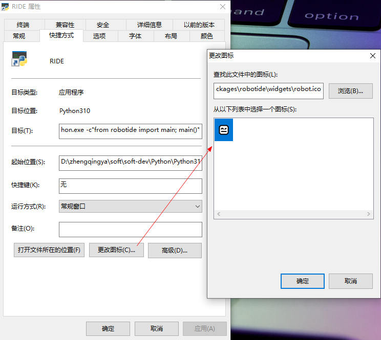
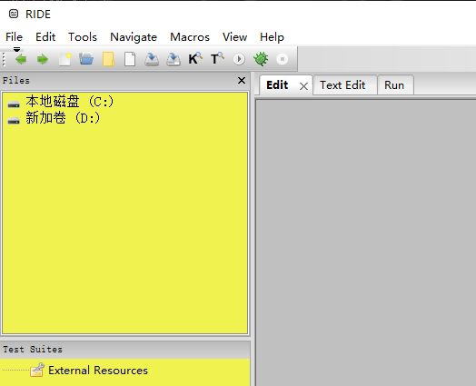

# 安装

> https://github.com/robotframework/robotframework/blob/master/INSTALL.rst

```shell
pip install robotframework
robot --version
# Robot Framework 6.0.2 (Python 3.10.6 on win32)

# 可视化编程开发包
pip install wxpython

# RIDE编辑器
pip install robotframework-ride

# web自动化插件
pip install robotframework-selenium2library
```

### Selenium环境配置

1. 查看谷歌浏览器版本 `右上角三个点` -> `帮助` -> `关于 Google Chrome`
2. 根据自己的浏览器版本(版本前面的数值即可)下载对应驱动 https://chromedriver.chromium.org/downloads
   ( 我这里使用的版本 https://chromedriver.storage.googleapis.com/index.html?path=109.0.5414.74/ )
3. 解压`chromedriver_win32.zip`，将`chromedriver.exe`
   放到python安装目录下`D:\zhengqingya\soft\soft-dev\Python\Python310\chromedriver.exe`

### RIDE程序

> 可以在cmd中运行`python D:\zhengqingya\soft\soft-dev\Python\Python310\Scripts\ride.py`
> tips: 选择自己python安装目录下的 `xx\Scripts\ride.py`

在桌面新建快捷方式，填写`D:\zhengqingya\soft\soft-dev\Python\Python310\python.exe -c"from robotide import main; main()"`


更改RIDE快捷方式图标：`右击` -> `属性` -> `快捷方式` -> `更改图标`
选择图标 `D:\zhengqingya\soft\soft-dev\Python\Python310\Lib\site-packages\robotide\widgets\robot.ico`


最终


双击打开RIDE

