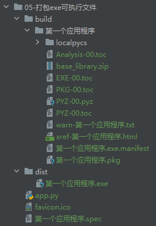

# Python程序打包为exe可执行文件

### 测试程序

`app.py`

```
import time

print("HelloWorld")
question = input("请输入你的问题：")
print("\n结果：", question)
time.sleep(5)
```

### 打包

```shell
# 安装
pip install pyinstaller

# 编译可执行文件
pyinstaller -F app.py

# -F：指定打包后只生成一个exe格式的文件
# -w：不显示windows cmd窗口 （GUI程序的话可以加上这个参数）
# -i：指定应用程序图标
# -n：程序名
# pyinstaller -F -w -i favicon.ico -n 第一个应用程序 app.py
pyinstaller -F -i favicon.ico -n 第一个应用程序 app.py
```

报错：

```shell
The 'pathlib' package is an obsolete backport of a standard library package and is incompatible with PyInstaller. Please remove this package (located in D:\zhengqingya\soft\soft-dev\Python\anaconda3\lib\site-packages) using
    conda remove
then try again.
```

解决：

```shell
pip uninstall pathlib
```

再次打包后生成的文件目录

