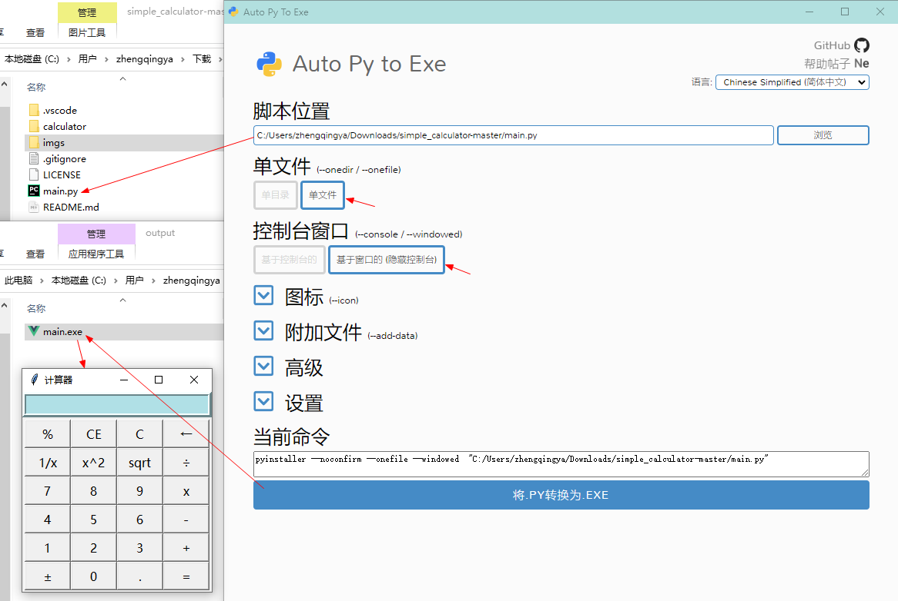

# Python程序打包为exe可执行文件 - `auto-py-to-exe`

https://github.com/brentvollebregt/auto-py-to-exe

`auto-py-to-exe` 基于 `pyinstaller`，新增了GUI界面，使用简单方便。

### 一、安装

```shell
pip install auto-py-to-exe
```

### 二、启动

打开 `cmd` 输入

```shell
auto-py-to-exe
```


### 三、使用

1. 选择脚本文件位置
2. 选择其他选项并添加图标或其他文件之类的内容
3. 点击底部的蓝色大按钮进行转换
4. 完成后在目录 `/output` 中找到转换后的文件


`.ico`图标在线转换工具： http://www.ico8.net

---

### 打包`计算器`

https://github.com/pythonprogrammingbook/simple_calculator


