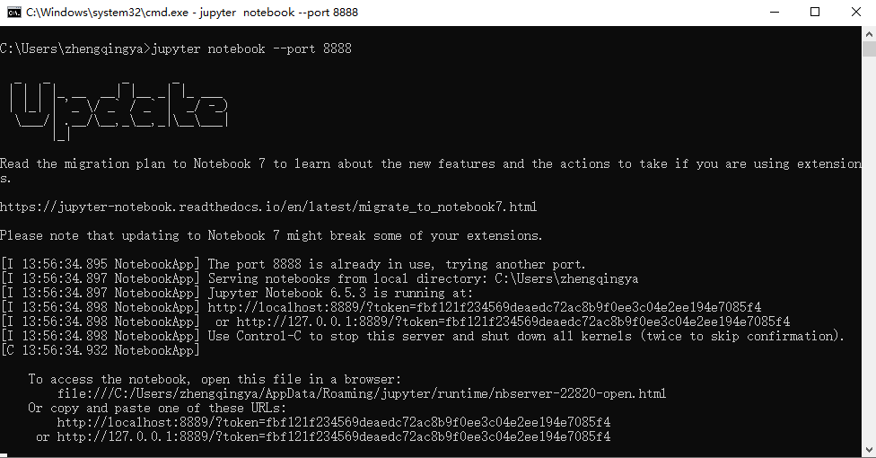
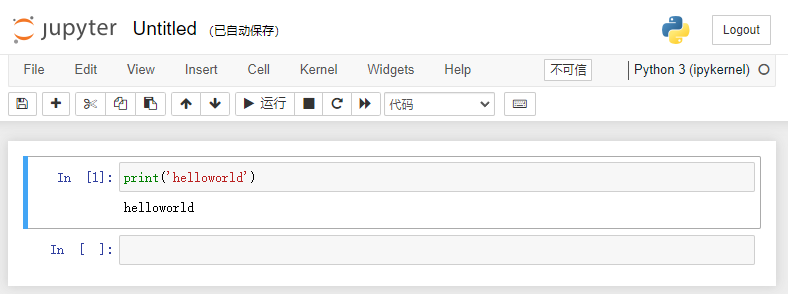

# Jupyter Notebook

https://github.com/jupyter/notebook

基于Web的交互式笔记本。
可以在网页中直接编写代码和运行代码。

### 安装

```shell
pip install jupyter
```

启动

```shell
jupyter notebook

# 指定端口启动
jupyter notebook --port 8888

# 启动服务器但不打开浏览器
jupyter notebook --no-browser
```



