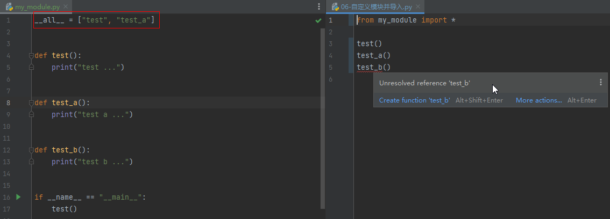

### 自定义模块

> 每个Python文件都可以作为一个模块，模块的名字就是文件的名字

`my_module.py`

```
def test():
    print("test ...")
```

#### 导入自定义模块使用

语法：`[from 模块名] import [模块|类|变量|函数|*] [as 别名]`

```
import my_module

my_module.test()
```

#### 导入不同模块的同名功能

后导入的会覆盖之前导入的

```
from my_module1 import test
from my_module2 import test

test()  # 使用my_module2中的test
```

### `__main__`

> 如果其它模块里有执行函数的代码，当我们在导入其它模块时，也会默认执行
> 

`__main__`：当程序直接被执行时才进入if内部，如果是通过导入方式则不会被执行

`my_module.py`

> 这里会执行test逻辑代码

```
def test():
    print("test ...")


if __name__ == "__main__":
    test()
```

> 这里不会执行test逻辑代码

```
from my_module import test
```


### `__all__`

控制`import *`时哪些功能可以被导入



```
__all__ = ["test", "test_a"]


def test():
    print("test ...")


def test_a():
    print("test a ...")


def test_b():
    print("test b ...")


if __name__ == "__main__":
    test()
```

```
from my_module import *

test()
test_a()
# test_b() # 这里无法调用
```