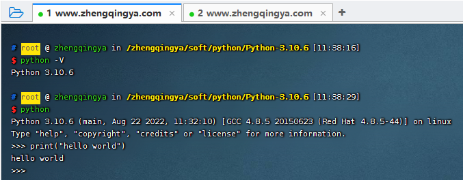

### Linux上安装Python环境

下载解释器地址 https://www.python.org/downloads


```shell
cd /zhengqingya/soft/python

# 安装所需依赖 
yum install wget zlib-devel bzip2-devel openssl-devel ncurses-devel sqlite-devel readline-devel tk-devel gcc make zlib zlib-devel libffi-devel -y

# 下载解释器 -- 如果慢的话，可通过直接下载上图中给出的源码包，然后上传到服务器上
wget https://www.python.org/ftp/python/3.10.6/Python-3.10.6.tgz

# 解压
tar -xvf Python-3.10.6.tgz

cd Python-3.10.6

# 配置
./configure --prefix=/usr/local/python3.10.6

# 编译
make && make install

# 查看旧软链接
ls -l /usr/bin/python*

# 删除系统自带的老版本(python2)的软链接
rm -f /usr/bin/python

# 创建软链接
ln -s /usr/local/python3.10.6/bin/python3.10 /usr/bin/python

# 测试 -- 可在任意地方执行
python -V
```



#### 问题：创建软链接后，会破坏yum程序的正常使用（只能使用系统自带的python2）

```
$ yum install git 
  File "/usr/bin/yum", line 30
    except KeyboardInterrupt, e:
           ^^^^^^^^^^^^^^^^^^^^
SyntaxError: multiple exception types must be parenthesized
```

解决：将第一行的 `#!/usr/bin/python` 修改为 `#!/usr/bin/python2`

```shell
vim /usr/bin/yum
vim /usr/libexec/urlgrabber-ext-down
```
